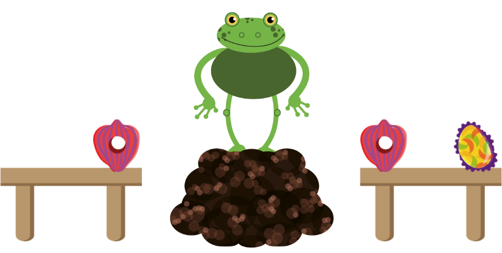
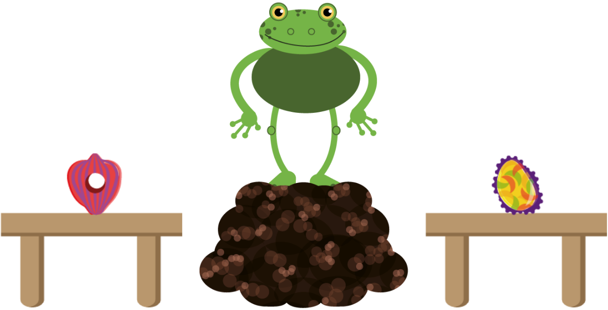

```{r setup, include=FALSE}
knitr::opts_chunk$set(echo = F, warning = F, message = F, include = T)
library(papaja)
library(tidyverse)
library(knitr)
library(ggthemes)
library(langcog)
library(rwebppl)
library(coda)
library(matrixStats)
library(ggpubr)
library(lme4)
library(broom)

estimate_mode <- function(s) {
  d <- density(s)
  return(d$x[which.max(d$y)])
}

hdi_upper<- function(s){
  m <- HPDinterval(mcmc(s))
  return(m["var1","upper"])
}

hdi_lower<- function(s){
  m <- HPDinterval(mcmc(s))
  return(m["var1","lower"])
}

```


```{r}
# load data files

# adults exp 1 
adult_ex1_data <- read_csv(file="../../stats/data/adult_ex1.csv")
# adults exp 2 novelty
adult_ex2_novelty_data <- read_csv(file="../../stats/data/adult_ex2_novelty.csv")
# adults exp 2 preference
adult_ex2_preference_data <- read_csv(file="../../stats/data/adult_ex2_preference.csv")
# adults ex3
adult_ex3_data <-read_csv(file="../../stats/data/adult_ex3.csv")
# prior strength manipulation experiments in experiment 4
adult_ex4_prior_data <-read_csv(file="../../stats/data/adult_ex4_prior.csv") 
# adults ex4
adult_ex4_data <-read_csv(file="../../stats/data/adult_ex4.csv") 

# children ex1
child_ex1_data <-read_csv(file="../../stats/data/child_ex1.csv")
# children ex2 preference
child_ex2_data <-read_csv(file="../../stats/data/child_ex2.csv") 
# children ex3
child_ex3_data <-read_csv(file="../../stats/data/child_ex3.csv") 
```


# Overview

Here we present details for the cognitive models as well as supplementary analysis and results. Readers who are interested in the model code and analysis code itself are encouraged to consult the associated online repository: https://github.com/manuelbohn/mcc.  

# Cognitive Models

Cognitive models were implemented in WebPPL [@dippl] using the r package `rwebppl` [@R-rwebppl].

## Ontology

The situation we model is defined by three sets: referents $r$, utterances $u$, and lexica $\mathcal{L}$. 
Referents are defined by two features $r_{t, l}$: the type of object they are $t$ (visually discernible given their shape and color) and their location $l$ (one of two tables).
There are two types of objects $t_1$, $t_2$ and two locations $l_1$ and $l_2$.
The utterances $u$ available to a speaker are (action, label) pairs $(u_a, u_w)$, where the action involves turning (pointing) to a particular location (a table) and labels are novel words ($w_1$, $w_2$), which are assumed to refer to the *type* of the object.
There are two kinds of lexica, corresponding to the two utterance components: The lexicon of pointing $\mathcal{L}_{point}$ and the lexica of labels $\mathcal{L}_1, \mathcal{L}_2$.
The lexicon of pointing $\mathcal{L}_{point}$ encodes the meaning of a point: The action of pointing reduces the set of referents to those that are on the table targeted by the point.
The lexica of labels map labels $u_w$ onto referents: $\mathcal{L}_1$ which maps label 1 $w_1$ to type 1 $t_1$ and label 2 $w_2$ to type 2 $t_2$, and $\mathcal{L}_2$ which has the inverse mapping. 

## Pragmatics model

Our word-learning model is a model of pragmatic reasoning couched in the Rational Speech Act modeling framework [@frank2012predicting; @goodman2016pragmatic]. The model describes the following process: A pragmatic listener ($L_1$) jointly infers a referent (what object is being picked out by the utterance) and a lexicon (label--type mappings) by reasoning about a pragmatic speaker ($S_1$) who produces utterances to convey information to a literal listener ($L_0$), who in turn interprets utterances according to their literal meaning. According to Bayes rule, the pragmatic listener's inference is given by:

\begin{equation} 
P_{L_1}(r, \mathcal{L}|u)\propto P_{S_1}(u|r_{t}, \mathcal{L})P( \mathcal{L})P(r)
\end{equation} 

The right-hand side of this equation has three terms: the prior distribution over referents $P(r)$, the prior distribution over lexica $P(\mathcal{L})$, and the likelihood $P_{S1}(u|r_t, \mathcal{L})$ that a speaker would produce an utterance $u$ given a referent type $r_t$ and their lexicon $\mathcal{L}$.

In the situation we model, the prior on referents $P(r)$ is a categorical distribution over three objects in a scene, which we posit could be non-uniform due to what is in common ground (see main text and below for information on common ground manipulations). 
Because the labels produced by the speaker are all novel words, the listener has no substantive knowledge about the lexica (label--type mappings) and thus the prior over the two lexica (described above) is uniform.

The pragmatic listener updates their beliefs about both the referent and the lexicon by reasoning about the speaker, assumed to produce utterances to convey the referent type ($r_t$) to the listener by being a soft-max rational agent (with degree of rationality $\alpha$) with a utility function defined in terms of the informativity of an utterance for a referent type ($r_t$):

\begin{equation} 
P_{S_1}(u_{a,l} | r_t, \mathcal{L})\propto Informativity(u_a;r_t)^\alpha \cdot P(u_l \mid \mathcal{L})
\end{equation} 

The speaker's utterances are (action, label) pairs $(u_a, u_l)$ (i.e., we assume the speaker must point to one of the locations and must produce a label). The label the speaker produces $u_l$ depends upon their lexicon $\mathcal{L}$ (i.e., they choose the label that is consistent with the object under their lexicon).The action (point) the speaker produces $u_a$ is a function of that signal's informativity. That is, because the listener does not know the meaning of the labels, the labels carry no information to the listener.

The informativity of the utterance (action) for a referent is the probability that a naive listener $L_0$ would select a the type of referent ($r_t$) given that utterance (action)[@goodman2013knowledge].

\begin{equation} 
Informativity(u_a; r_t) = P_{L_0}(r_t|u_a)
\end{equation} 

\noindent where the probability that the naive listener $L_0$ would select a referent of a given type $r_t$ given the utterance $u_a$ is given by Bayes' Rule:

\begin{equation} 
P_{L_0}(r_t|u) = \sum_{r_i \in t} P_{L_0}(r_i | u) \propto \mathcal{L}_{point} P(r_i)
\end{equation} 

\noindent where $\mathcal{L}_{point}$ encodes the meaning of the actions (points), and is simply a truth-function stipulating that the location of the referent must be at the location of the point.

We assume in this model that the speaker is trying to convey the type of the referent $r_t$ rather than the individual token referents $r_i$; thus, the relevant probability for purposes of informativity is the type probability $P_{L_0}(r_t|u)$, which is simply a sum of the token probabilities for tokens that are of the same type $\sum_{r_i \in t} P_{L_0}(r_i | u)$.


$P(r)$ again denotes the prior probability of a referent, $\mathcal{L}_{point}$ encodes the literal meaning of a point, returning 1 if the object is at the location of the point and 0 if the utterance if not. As mentioned above, because $L_1$ does not know the lexicon, the semantics of the words contained in the utterance (i.e., the labels) offer no information about the referent. The non-linguistic aspect of the utterance (pointing), however, do. As described above, the semantics of turning to one of the tables is roughly equivalent to saying "It's an object on that table". 


The above formulation of a literal interpretation model based only on the semantics of the non-linguistic signals (points) can also be derived by positing a literal interpretation model that updates their beliefs according to the literal meanings of both labels and points, but which is uncertain about the meaning of the labels:  $P_{L_0}(r, \mathcal{L}|u)  \propto \mathcal{L}_{lit} P(r) P(\mathcal{L})$.


## Worked Example

In this section, we work through a toy numerical example for how model predictions were generated for the pragmatics model. The prediction will correspond to the parameter free model described above (excluding the noise parameter). The values of the parameters are taken from a preference  condition (see below). Fig. \ref{fig:figS1} shows a screenshot from the adult experiment, which the model was designed to capture. In this context, there are three potential referents of two types (pink-ish and yellow-ish; for simplicity, we refer refer the object's type by its color) on two tables: $r_{type:pink, table: 1}$, $r_{type:pink,table: 2}$; one yellow-ish, $r_{type:yellow,table: 2}$). For simplicity, we refer to the referents by the shorthand: $r_{p1}, r_{p2}, r_{y2}$.
In principle, the speaker, the frog in this case, can produce one of four utterances, pointing either to the left or right table and saying either label ("dax" or "wug"):  $u_1 = (\text{left}, dax)$, $u_2 = (\text{left}, wug)$, $u_3 = (\text{right}, dax)$, $u_4 = (\text{right}, wug)$.
We work out the example where the speaker produces utterance $u_3$, pointing to the right table (two objects) and saying the label "dax" (though since the labels have no *a priori* meanings, the computation would be the same for utterance $u_4$). 

```{r figS1, include = T, fig.align = "center", fig.cap = "Screenshot showing test situation Experiment 1, 3 and 4.", out.width="400px"}

```

As mentioned above, the listener is learning the mappings between labels and object types (rather than object tokens). That is, the listener either believes the novel word "dax" refers to "pink-ish objects" or "yellow-ish objects". Pointing to a table always has the same meaning. These semantics can be described using two lexica: $\mathcal{L}_1 = \{dax: \text{pink-ish thing}, wug: \text{yellow-ish thing}, point: \text{location of point}\}$, $\mathcal{L}_2 = \{dax: \text{yellow-ish thing}, wug: \text{pink-ish thing}, point: \text{location of point}\}$.

We construct the prior distribution over referents $P(r)$ based on the results of Experiment 2A, in which a different speaker displayed a preference for a yellow-ish object. The prior distribution over referents $P(r)$ (left to right in Fig. \ref{fig:figS1}) in the example that follows was [0.26, 0.26, 0.48] (see Model Parameters section below for a detailed description of how this distribution was constructed).

We assume that the intentional goal of the speaker is to get the listener to select an object of the correct type. That is, the informativity of an utterance is calculated with respect to conveying the correct object type as opposed to a particular referent (token).

First, we calculate the literal listener's posterior distribution over referents, and marginalize (average) over objects of the same type to compute the informativity of an utterance for a type.
<!-- The literal listener's posterior distribution over referents and lexica has support of size six, owing to the unique combinations of referents and lexica. -->

$$
\begin{aligned}
& P_{L_0}(r_{p1}| {u_3})  \propto \mathcal{L}_{point}(r_{p1}, u_3) P(r_{p1})  = 0 \times 0.26  =0\\
& P_{L_0}(r_{p2}| {u_3})  \propto \mathcal{L}_{point}(r_{p2}, u_3) P(r_{p2})= 1 \times 0.26  =0.26\\
& P_{L_0}(r_{y2} | {u_3})  \propto \mathcal{L}_{point}(r_{y2}, u_3) P(r_{y2})  = 1 \times 0.48  = 0.48
\end{aligned}
$$

<!-- $$ -->
<!-- \begin{aligned} -->
<!-- & P_{L_0}(r_{p1}, \mathcal{L}_1 | {u_3})  \propto \mathcal{L}_1(r_{p1}, u_3) P(r_{p1}) P(\mathcal{L}_1) = 0 \times 0.26 \times 0.5 =0\\ -->
<!-- & P_{L_0}(r_{p2}, \mathcal{L}_1 | {u_3})  \propto \mathcal{L}_1(r_{p2}, u_3) P(r_{p2}) P(\mathcal{L}_1) = 1 \times 0.26 \times 0.5 =0.13\\ -->
<!-- & P_{L_0}(r_{y2}, \mathcal{L}_1 | {u_3})  \propto \mathcal{L}_1(r_{y2}, u_3) P(r_{y2}) P(\mathcal{L}_1) = 0 \times 0.48 \times 0.5 =0\\ -->
<!-- & P_{L_0}(r_{p1}, \mathcal{L}_2 | {u_3})  \propto \mathcal{L}_2(r_{p1}, u_3) P(r_{p1}) P(\mathcal{L}_2) = 0 \times 0.26 \times 0.5=0\\ -->
<!-- & P_{L_0}(r_{p2}, \mathcal{L}_2 | {u_3})  \propto \mathcal{L}_2(r_{p2}, u_3) P(r_{p2}) P(\mathcal{L}_2) = 0 \times 0.26 \times 0.5=0\\ -->
<!-- & P_{L_0}(r_{y2}, \mathcal{L}_2 | {u_3})  \propto \mathcal{L}_2(r_{y2}, u_3) P(r_{y2}) P(\mathcal{L}_2) = 1 \times 0.48 \times 0.5=0.24\\ -->
<!-- \end{aligned} -->
<!-- $$ -->


because the speaker is pointing to the right table with $r_{p2}$ and $r_{y2}$.
After normalization we have:

$$
\begin{aligned}
& P_{L_0}(r_{p1}| {u_3}) = 0 \\
& P_{L_0}(r_{p2}| {u_3}) = 0.35 \\
& P_{L_0}(r_{y2} | {u_3}) = 0.65
\end{aligned}
$$

In order to get the distribution over types (instead of tokens), we simply add up the probabilities for each token from the same type.

$$
\begin{aligned}
& Informativity(u_3; r_p) = P_{L_0}(r_p | {u_3}) = P_{L_0}(r_{p1}| {u_3})  + P_{L_0}(r_{p2}| {u_3})  = 0+ 0.35 =0.35 \\
& Informativity(u_3; r_p) = P_{L_0}(r_y | {u_3}) = P_{L_0}(r_{y2} | {u_3}) = 0.65\\
\end{aligned}
$$

In a similar way, we can compute the informativity of the other utterances. Since the words have no *a priori* meanings, $u_4$ (pointing to the right and saying "wug") will have the same informativity values as $u_3$ (pointing the right and saying "dax"). The informativity vectors for $u_1$ and $u_2$ (pointing to the left and saying either "dax" or "wug") are also identical and given by: 

$$
\begin{aligned}
&Informativity(u_1; r_p) = P_{L_0}(r_p|u_1) = 1\\
&Informativity(u_1; r_y) = P_{L_0}(r_y|u_1) = 0
\end{aligned}
$$
We assume that the speaker knows the lexicon, but doesn't believe the listener to know the lexicon. That is, the generative process of the utterance is tantamount to pointing to the table with the referent of the type the speaker wants and incidentally labeling it. The label itself carries no information.

Based on euqation 2 we can now compute the likelihood of each utterance given an object type. Recall the two lexica: $\mathcal{L}_1 = \{dax: \text{pink-ish thing}, wug: \text{yellow-ish thing} \}$, $\mathcal{L}_2 = \{dax: \text{yellow-ish thing}, wug: \text{pink-ish thing}\}$, and the four utterances:  $u_1 = (\text{left}, dax)$, $u_2 = (\text{left}, wug)$, $u_3 = (\text{right}, dax)$, $u_4 = (\text{right}, wug)$.
We begin with the pink-ish type ($r_p$). If the speaker's lexicon were $\mathcal{L}_1$:

$$
P_{S_1}(u|r_p, \mathcal{L}_1) \propto   Informativity(u_a;r_p)^\alpha P(u \mid \mathcal{L}_1) = \begin{cases} 
1^{2.24} \times 1 = 1 & \mbox{for } u_1 \\
0^{2.24} \times 0 = 0& \mbox{for } u_2 \\
0.35^{2.24} \times 1 = 0.095  & \mbox{for } u_3 \\
1^{2.24} \times 0 = 0& \mbox{for } u_4 \\
\end{cases}
$$
To arrive at the production probabilities, we normalize by the values from the previous calculation so that they add to 1:

$$
P_{S_1}(u|r_p, \mathcal{L}_1) = \begin{cases} 
0.91  & \mbox{for } u_1 \\
0 & \mbox{for } u_2 \\
0.09  & \mbox{for } u_3 \\
0& \mbox{for } u_4 \\
\end{cases}
$$

The speaker's production probabilities are the same if the speaker's lexicon is $\mathcal{L}_2$, only the utterances use the other label:

$$
P_{S_1}(u|r_p, \mathcal{L}_2) = \begin{cases} 
0  & \mbox{for } u_1 \\
0.91 & \mbox{for } u_2 \\
0  & \mbox{for } u_3 \\
0.09& \mbox{for } u_4 \\
\end{cases}
$$
That is, if the speaker is trying to convey the pink-ish object type, the speaker would be 10 times more likely (under a speaker rationality parameter of 2.24) to point to the left table than to the right table. This corresponds with the intuition that pointing to the left table would be a much better way to refer to a pink-ish object. 
If instead the speaker wanted to convey the yellow-ish object type ($r_y$):

$$
P_{S_1}(u|r_y, \mathcal{L}_1) = Informativity(u;r_y)^\alpha \cdot P(u\mid \mathcal{L}_1) = \begin{cases} 
0^{2.24} \times 0 = 0 & \mbox{for } u_1 \\
0^{2.24} \times 0 = 0& \mbox{for } u_2 \\
0^{2.24} \times 0 = 0  & \mbox{for } u_3 \\
0.65^{2.24} \times 1 = 0.38& \mbox{for } u_4 \\
\end{cases}
$$

To arrive at the production probabilities, we normalize:

$$
P_{S_1}(u|r_y, \mathcal{L}_1) = \begin{cases} 
0  & \mbox{for } u_1 \\
0 & \mbox{for } u_2 \\
0  & \mbox{for } u_3 \\
1& \mbox{for } u_4 \\
\end{cases}
$$
and

$$
P_{S_1}(u|r_y, \mathcal{L}_2) = \begin{cases} 
0  & \mbox{for } u_1 \\
0 & \mbox{for } u_2 \\
1  & \mbox{for } u_3 \\
0& \mbox{for } u_4 \\
\end{cases}
$$

That is, the speaker would point to the right table and say the utterance consistent with their lexicon. Again, intuitively this makes sense because the yellow-ish object is located only on the right table and pointing to that table presents the only way one could refer to that object type.

Finally, based on equation 1 we can use these values to compute the probability that the listener thinks that the speaker is referring to the yellow-ish type ($r_y$) when they produce $u_3$ (pointing to the right table and saying "dax"). In this case, it is the same as the probability of the yellow-ish referent ($r_{y2}$) because there is only one yellow object.

$$
\begin{aligned}
&P_{L_1}(r_{y2}, \mathcal{L}|u_3 ) = \frac{P_{S_1}(u_3 \mid r_y, \mathcal{L}) \cdot P(\mathcal{L}) \cdot P(r_{y2})}{
\sum_{r'} P_{S_1}(u_3 \mid r', \mathcal{L}) \cdot P(\mathcal{L}) \cdot P(r')
}
\end{aligned}
$$


$$
\begin{aligned}
& P_{L_1}(r_{p1}, \mathcal{L}_1 | {u_3})  \propto P_{S_1}(u_3 \mid r_{p1}, \mathcal{L}_1) P(r_{p1}) P(\mathcal{L}_1) = 0.09 \times 0.26 \times 0.5 =0.012\\
& P_{L_1}(r_{p2}, \mathcal{L}_1 | {u_3})  \propto P_{S_1}(u_3 \mid r_{p2}, \mathcal{L}_1)  P(r_{p2}) P(\mathcal{L}_1) = 0.09 \times 0.26 \times 0.5 =0.012\\
& P_{L_1}(r_{y2}, \mathcal{L}_1 | {u_3})  \propto P_{S_1}(u_3 \mid r_{y2}, \mathcal{L}_1)  P(r_{y2}) P(\mathcal{L}_1) = 0 \times 0.48 \times 0.5 =0\\
& P_{L_1}(r_{p1}, \mathcal{L}_2 | {u_3})  \propto P_{S_1}(u_3 \mid r_{p1}, \mathcal{L}_2)  P(r_{p1}) P(\mathcal{L}_2) = 0 \times 0.26 \times 0.5=0\\
& P_{L_1}(r_{p2}, \mathcal{L}_2 | {u_3})  \propto P_{S_1}(u_3 \mid r_{p2}, \mathcal{L}_2) P(r_{p2}) P(\mathcal{L}_2) = 0 \times 0.26 \times 0.5=0\\
& P_{L_1}(r_{y2}, \mathcal{L}_2 | {u_3})  \propto P_{S_1}(u_3 \mid r_{y2}, \mathcal{L}_2) P(r_{y2}) P(\mathcal{L}_2) = 1 \times 0.48 \times 0.5=0.24\\
\end{aligned}
$$

After normalizing, the full joint-posterior distribution over referents and lexica is:

$$
\begin{aligned}
& P_{L_1}(r_{p1}, \mathcal{L}_1 | {u_3})  = 0.045\\
& P_{L_1}(r_{p2}, \mathcal{L}_1 | {u_3})  = 0.045\\
& P_{L_1}(r_{y2}, \mathcal{L}_1 | {u_3})  = 0 \\
& P_{L_1}(r_{p1}, \mathcal{L}_2 | {u_3})  = 0\\
& P_{L_1}(r_{p2}, \mathcal{L}_2 | {u_3})  = 0\\
& P_{L_1}(r_{y2}, \mathcal{L}_2 | {u_3})  = 0.91\\
\end{aligned}
$$

To arrive at the distribution over types, you simply add all of the referents of the same type and marginalize out the lexicon:

$$
\begin{aligned}
&P_{L_1}(r_p|u_3) =  \sum_{i \in {1, 2}} P_{L_1}(r_{p1}, \mathcal{L}_i|u_3) + P_{L_0}(r_{p2}, \mathcal{L}_i|u_3) = 0.09 \\
&P_{L_1}(r_y|u_3) =  \sum_{i \in {1, 2}} P_{L_1}(r_{y2}, \mathcal{L}_i|u_3)  = 0.91 \\
\end{aligned}
$$

To conclude the example, according to the parameter free pragmatics model, the proability that $L_1$ thinks that $S_1$ is reffering to a yellow-ish object when producing $u_3$ is 0.91. Based on this model we thus expected that, on average, participants would select the yellow-ish object in 91% of cases in a condition with the prior distribution specified above.  

## Prior only model

The prior only model ignored the information about the intended referent that was expressed by the utterance and instead only focused on common ground manipulation. The only inforamtion available to $L_1$ is the prior distribution over referents. It is therefore defined as: 

\begin{equation} 
P_{L_1}(r|u)\propto P(r)
\end{equation} 

That is, the probability of the referent given the utterance is determined by the prior probability of the referent for a particular speaker. The prior distributions were set in the same way as for the pragmatics model.

## Flat prior model

This model was identical in structure to the pragmatics model with the exception that the prior distribution did not correspond to the measurements from Experiment 2 and did not vary with speaker identity. That is, regardless of common ground manipulation and speaker identity the prior distribution was always uniform (i.e. [0.33,0.33,0.33]). The speaker optimality parameter $\alpha$ was set in the same way as in the pragmatics model. 

# Model parameters  

As noted in the main text, the parameter $\alpha$ (speaker optimality parameter) in equation 2 determines the absolute strength of the likelihood term. It's interpretation is *how* rational $L_1$ thinks $S_1$ is in this particular context. For adults, we used the data from Experiment 1 to infer the value of $\alpha$. That is, we inferred which value of $\alpha$ would generate model predictions for the pragmatics model (assuming equal prior probability over referents) that corresponded to the average proportion of correct responses measured in Experiment 1. This value for $\alpha$ was then used in Experiment 3 and 4. 

For children, the speaker optimality parameter changed with age. Instead of inferring a single value across age, we used the data from Experiment 5 to find the slope and intercept for $\alpha$ that best described the developmental trajectory in the data. As for adults, this was done via the pragmatics model with equal prior probability for each object. In Experiment 7, the speaker optimality parameter for a given child of a given age was computed by taking the overall intercept and adding the slope times the child's age (with age anchored at 0). The analysis code corresponding to these calculations can be found in the associated online repository.

The prior distribution over objects, $P(r)$, varied with the common ground manipulation, the identity of the speaker and the alignment of utterance and common ground information. Numerically, it depended on the measurement obtained in Experiment 2A and B for adults and Experiment 6 for children. Fig. \ref{fig:figS2} shows the test situation on Experiment 2.  

```{r figS2, include = T, fig.align = "center", fig.cap = "Screenshot showing test situation in Experiment 2 for adults.", out.width="400px"}

```

For adults, this worked in the following way: For example, in Experiment 2, for the preference/same speaker condition, when the speaker previously indicated that they liked the yellow-ish object (right table in Fig. \ref{fig:figS2}) and disliked the pink-ish object (left table in Fig.\ref{fig:figS2}), the average proportion with which participants chose the yellow-ish object  was `r adult_ex2_preference_data %>% filter(condition == "same_speaker") %>% summarise(mean = mean(correct)) %>% pull(mean)` and for the pink-ish object it was `r 1-adult_ex2_preference_data %>% filter(condition == "same_speaker") %>% summarise(mean = mean(correct)) %>% pull(mean)` respectively. In Experiment 3 and 4, this measurement determined the prior distribution over objects in cases whenever the the same manipulation was used (preference/same speaker). Note that Experiment 3 involved three objects while Experiment 2 only involved two. We nevertheless used the exact proportions measured in Experiment 2 for each object to inform the prior. This approach spread out the absolute probability mass but conserved the relative relation between objects. Thus, when utterance and common ground information were aligned (i.e. the yellow-ish object was the more informative object as in Fig. \ref{fig:figS1}), the distribution of objects was [$r_{p1}, r_{p2}, r_{y2}$]. Using the raw proportions, the corresponding prior distribution was [$P(r_{p}^1) = 0.03, P(r_{p}^2) = 0.03, P(r_{y}^2) = 0.97$] and after normalizing (so that they add up to 1) it was [0.03, 0.03, 0.94]. When information sources were dis-aligned (i.e. the pink-ish object was the more informative one), the object distribution was [$r_{y1}, r_{p2}, r_{y2}$] and the prior distribution was thus [0.97, 0.03, 0.97] or [0.49, 0.02, 0.49] after normalizing.

For children, we used the data from Experiment 6 to model the slope and intercept that best described the developmental trajectory in the data for each of the two conditions. As for the speaker optimality parameter, this allowed us to generate prior distributions that were sensitive to the child's age. In Experiment 7, the prior probability for an object was computed by taking the intercept for the respective condition (same or different speaker), adding the slope times the child's age and then using a logistic transformation to convert the outcome into proportions. The overall distribution then depended on the alignment of information sources in the same way as it did for adults. Model code for inferring the intercept and the slope for the child study can be found in the associated online repository.


# Prior strength manipualtions Experiment 4

```{r ex4 prior pre-tests data adults}
# load data from prior strength manipulation experiments to set priors
adult_ex4_prior_data <-read_csv(file="../../stats/data/adult_ex4_prior.csv") 
```

```{r table_prior,results = "asis"}
ex4_prior_models <- adult_ex4_prior_data %>%
  group_by(common_ground_manipulation,prior_manipulation)%>%
  do(models = glmer(correct ~ speaker + (1|id) + (1|agent),data = .,family=binomial,  control=glmerControl(optimizer="bobyqa",optCtrl=list(maxfun=2e5))))


ex4_prior_models_table <- tidy(ex4_prior_models, models)%>%
  filter(group == "fixed")%>%
  select(-statistic, -group)%>%
  mutate(p.value = ifelse(p.value<.001,"< .001",as.character(paste("=",substr(round(p.value,3),2,5),sep=" "))),
         std.error = round(std.error,2),
         estimate = round(estimate,2),
         term = case_when(term == "(Intercept)" ~ "Intercept",
                          term == "speakersame_speaker" ~ "condition (same speaker)"))%>%
  rename(Manipulation = common_ground_manipulation,
         Strength = prior_manipulation,
         Term = term,
         Estimate = estimate,
         SE = std.error,
         p = p.value)

apa_table(
  ex4_prior_models_table
  , caption = "Model output for prior strength experiments "
  , note = "Model structure in all cases: correct ~ condition + (1|id) + (1|agent)"
  , escape = T
)
```

Below we describe the different ways in which prior strength was manipulated in Experiment 4. The corresponding experiments can be found in the online repository. The test event was always the same: The animal disappeared and then either the same or a different animal returned and requested an object using an unknown word.

For preference, at the beginning of the experiment both tables contained an object. In preference/strong the animal turned to one side and stated that they liked (“Oh wow, I really like that one”) or disliked (“Oh bleh, I really don’t like that one”) the object. Then they turned the other side and expressed the respective other attitude. In preference/medium the animal only turned to one side and expressed liking in a more subtle way (saying only: “Oh, wow”). 

For novelty, one table was empty while there was an object on the other. In novelty/strong the animal turned to one of the sides and commented either on the presence (“Aha, look at that”) or the absence of an object (“Hm, nothing there”). Then the animal turned to the other side and commented in a complementary way. Next, the animal disappeared. The same animal re-appeared and the sequence above was repeated. When the animal disappeared for the second time, a second object appeared on the empty table while the animal was away. In novelty/medium, the animal commented on the presence/absence of objects in the same way but did so only once. In novelty/weak, the animal only turned to the present object and commented on it. 

In all cases, the order of utterances and/or the side to which the speaker turned first were counterbalanced. Figure \ref{fig:priorplot} shows the results for the same speaker and different speaker conditions for each manipulation.

```{r priorplot, fig.cap = "Results from prior strength manipulation Experiments. Transparent dots show data from individual participants, diamonds represent condition means, error bars are 95\\% CIs. Dashed line indicates performance expected by chance.", fig.height = 3}

p_adult_ex4_priors <- adult_ex4_prior_data%>%
  mutate(prior_manipulation = relevel(as.factor(prior_manipulation), ref = "strong"))%>%
  group_by(common_ground_manipulation,prior_manipulation,speaker, id) %>%
  summarise(correct = mean(correct))
  

p_adult_ex4_priors_ci <- p_adult_ex4_priors %>%
  multi_boot_standard(col = "correct")

ggplot() +
  geom_jitter(data = p_adult_ex4_priors, aes(x = speaker, y = correct, col = speaker), alpha = 0.3, width = .3,height = .02)+
  geom_pointrange(data = p_adult_ex4_priors_ci, aes(x = speaker, y = mean, col = speaker,ymin = ci_lower, ymax = ci_upper),size = .8, pch = 5, fatten = 2.5)+
  geom_hline(yintercept = 0.5, lty=2)+
  labs(x="",y="")+
  facet_grid(common_ground_manipulation ~ prior_manipulation)+
  theme_few() + 
  ylim(-0.05,1.05)+
  guides(alpha = F,size =F)+
  scale_color_solarized()+
  theme(axis.text.x = element_blank(), axis.ticks.x = element_blank(), legend.position = "right")
```

Table \ref{tab:table_prior} shows the results of a generalized linear mixed model (GLMM) fit to the data from each manipulation. The results show that the parameter estimates for condition (i.e. difference between same speaker and different speaker condition) decreases in line with the hypothesized effect of the prior manipulation. 

# Model comparison

Analysis code for model comparison can be found in the online repository.

## Experiment 3

Here we report details on the model comparisons. Model fit was assessed based on marginal log-likelihoods of the data under each model. Bayes Factors were computed by first subtracting log-likelihoods for two models and then exponentiating the result. Table \ref{tab:ex3_comp} shows Bayes Factors for model comparisons in Experiment 3. We did not pre-register the inclusion of the noise parameter for Experiment 3, but did so for all subsequent experiments for which we did model comparisons (4 and 7). The first row in Table \ref{tab:ex3_comp} compares the pragmatics model with noise parameter to the model without the noise parameter. This comparison shows that including the noise parameter greatly improves model fit. Figure \ref{fig:modelpredex3} correlates model predictions from the models including noise parameters to the data from Experiment 3. 

```{r modelpredex3, include = T, fig.cap = "Correlation plot for model predictions and data from Experiment 3. All models depicted here included a noise parameter. Coefficients and p-values are based on Pearson correlation statistics. Dots represent condition modes. Error bars represent 95\\% HDIs.", fig.height=2.5}

adult_ex3_data_summary <- adult_ex3_data %>%
  mutate(model = "data") %>%
  group_by(model,common_ground_manipulation,speaker,alignment)%>%
  summarize(k = sum(correct_inf), n = n())%>%
  ungroup() %>%
  mutate(a = 1 + k,
         b = 1 + n - k,
         ci_lower  = qbeta(.025, a, b),
         ci_upper = qbeta(.975, a, b),
         mean = (a-1)/(a+b-2))%>%
  select(-a,-b,-n,-k)

# summarize model predictions

ex3_flat_prior_model_pred_noise <- readRDS("../../stats/saves/ex3_flat_prior_model_noise.rds") %>%
  filter(!(Parameter %in% c("noise")))  %>%
  separate(Parameter, into = c("common_ground_manipulation","speaker", "alignment"), sep="/")%>%
  mutate(model="flat_prior_noise")%>%
  group_by(model,common_ground_manipulation,speaker,alignment)%>%
  summarise(mean = estimate_mode(value), 
            ci_lower = hdi_lower(value),
            ci_upper = hdi_upper(value))

ex3_prior_only_model_pred_noise <- readRDS("../../stats/saves/ex3_prior_only_model_noise.rds") %>%
  filter(!(Parameter %in% c("noise")))  %>%
  separate(Parameter, into = c("common_ground_manipulation","speaker", "alignment"), sep="/")%>%
  mutate(model="prior_only_noise")%>%
  group_by(model,common_ground_manipulation,speaker,alignment)%>%
  summarise(mean = estimate_mode(value), 
            ci_lower = hdi_lower(value),
            ci_upper = hdi_upper(value))

ex3_pragm_model_pred_noise <- readRDS("../../stats/saves/ex3_pragm_model_noise.rds") %>%
  filter(!(Parameter %in% c("noise")))  %>%
  separate(Parameter, into = c("common_ground_manipulation","speaker", "alignment"), sep="/")%>%
  mutate(model="pragmatic_noise")%>%
  group_by(model,common_ground_manipulation,speaker,alignment)%>%
  summarise(mean = estimate_mode(value), 
            ci_lower = hdi_lower(value),
            ci_upper = hdi_upper(value))


ex_3_model_pred <- bind_rows(
  ex3_flat_prior_model_pred_noise,
  ex3_prior_only_model_pred_noise,
  ex3_pragm_model_pred_noise
)
 
# combine model predictions and data

ex_3_pred <- bind_rows(
  ex_3_model_pred,
  adult_ex3_data_summary
)

ex_3_cor_plot <- ex_3_pred %>%
  ungroup()%>%
  filter(model != "data") %>%
  left_join(., ex_3_pred %>%
    ungroup()%>%
    filter(model == "data") %>%
    rename(data_mean = mean, data_ci_lower = ci_lower, data_ci_upper = ci_upper) %>%
    select(-model)
  )%>%
  mutate(model =  case_when(model == "pragmatic_noise" ~ "Pragmatics",
                            model == "prior_only_noise" ~ "Prior only",
                            model == "flat_prior_noise" ~ "Flat prior"
                            ))


ggplot(data = ex_3_cor_plot,aes(x = mean, y = data_mean, col = "1")) +
  geom_abline(intercept = 0, slope = 1, lty = 2, alpha = 0.7, size = 0.5)+
  geom_point(size = 2)+
  geom_errorbar(aes(ymin = data_ci_lower, ymax = data_ci_upper),width = 0,size = .7)+
  geom_errorbarh(aes(xmin = ci_lower, xmax = ci_upper), height = 0,size = .7)+
  coord_fixed()+
  xlim(0,1)+ylim(0,1)+
  xlab("Model")+
  ylab("Data")+
  facet_grid ( ~ model) +
  guides(col = F)+
  stat_cor(method = "pearson", label.x = 0.01, label.y = 0.99, aes(x = mean, y = data_mean), inherit.aes = F, size = 3)+
  theme_few(base_size = )+
  scale_color_manual(values = c("#4477AA"))+
  theme(legend.position = "right")

```

```{r ex3_comp,results = "asis"}
log_like_pragmatic_ex3 <- readRDS("../../stats/saves/ex3_pragm_model_loglike.rds")

ex3_pragm_model_noise_loglike <- readRDS("../../stats/saves/ex3_pragm_model_noise_loglike.rds")%>%
  mutate(model = "pragmatic_noise")%>%
  group_by(model)%>%
  summarize(logP = logSumExp(value))

ex3_prior_only_model_noise_loglike <- readRDS("../../stats/saves/ex3_prior_only_model_noise_loglike.rds")%>%
  mutate(model = "prior_only_noise")%>%
  group_by(model)%>%
  summarize(logP = logSumExp(value))

ex3_flat_prior_model_noise_loglike <- readRDS("../../stats/saves/ex3_flat_prior_model_noise_loglike.rds")%>%
  mutate(model = "flat_prior_noise")%>%
  group_by(model)%>%
  summarize(logP = logSumExp(value))

ex3_model_comparison <- bind_rows(
  log_like_pragmatic_ex3,
  ex3_pragm_model_noise_loglike,
  ex3_flat_prior_model_noise_loglike,
  ex3_prior_only_model_noise_loglike
)%>%
  mutate(model = reorder(model,logP))

ex3_bf <- bind_rows(
  log_like_pragmatic_ex3,
  ex3_pragm_model_noise_loglike,
  ex3_flat_prior_model_noise_loglike,
  ex3_prior_only_model_noise_loglike
) %>% spread(model, logP) %>%
  mutate("pragmatic_noise > pragmatic" = exp(pragmatic_noise - pragmatic),
         "pragmatic_noise > prior_only_noise" = exp(pragmatic_noise - prior_only_noise),
         "pragmatic_noise > flat_prior_noise" = exp(pragmatic_noise - flat_prior_noise),
         "prior_only_noise > flat_prior_noise" = exp(prior_only_noise - flat_prior_noise)) %>%
  select(-pragmatic,-pragmatic_noise, -flat_prior_noise, -prior_only_noise)%>%
  gather(Comparison, BF)%>%
  mutate(BF = formatC(BF,2))

apa_table(
  ex3_bf
  , caption = "Bayes Factors for model comparisons in Experiment 3"
  , escape = T
)

```

```{r ex3noise, include = T, fig.cap = "Posterior distribution of noise parameter for each model in Experiment 4", fig.height = 2}
ex3_noise_parameters <- bind_rows(
  readRDS("../../stats/saves/ex3_pragm_model_noise.rds") %>%
  filter(Parameter %in% c("noise"))  %>%
  mutate(Model = "Pragmatics"),
  readRDS("../../stats/saves/ex3_prior_only_model_noise.rds") %>%
  filter(Parameter %in% c("noise"))  %>%
  mutate(Model = "Prior only"),
  readRDS("../../stats/saves/ex3_flat_prior_model_noise.rds") %>%
  filter(Parameter %in% c("noise"))  %>%
  mutate(Model = "Flat prior")
  )

ggplot(ex3_noise_parameters, aes(x = value, col = Model, fill = Model))+
  geom_density(alpha = .5)+
  theme_few()+
  xlab("Noise parameter")+
  xlim(0,1)+
  scale_color_manual(breaks=c("Pragmatics","Prior only","Flat prior"),
                    values= c("#b58900","#6c71c4","#859900"))+
  scale_fill_manual(breaks=c("Pragmatics","Prior only","Flat prior"),
                    values= c("#b58900","#6c71c4","#859900"))
```

Figure \ref{fig:ex3noise} shows the posterior distribution of the noise parameter under each model. The noise parameter was fit to the data and indicates the proportion of responses that are estimated to be due to random guessing rather than in line with model predictions. Consequently, a model that makes predictions that are closer to the data is likely to have a lower noise parameter. The results corroborate the model comparison by showing that the pragmatics model has the lowest noise parameter.  

## Experiment 4

```{r modelpredex4, include = T, fig.cap = "Correlation plot for model predictions and data from Experiment 4. All models included a noise parameter. Coefficients and p-values are based on Pearson correlation statistics. Dots represent condition modes. Error bars represent 95\\% HDIs.", fig.height=3}

adult_ex4_data_summary <- adult_ex4_data %>%
  mutate(prior_manipulation = relevel(as.factor(prior_manipulation), ref = "strong"))%>%
  mutate(model = "data") %>%
  group_by(model,common_ground_manipulation,prior_manipulation,speaker,alignment)%>%
  summarize(k = sum(correct_inf), n = n())%>%
  ungroup() %>%
  mutate(a = 1 + k,
         b = 1 + n - k,
         ci_lower  = qbeta(.025, a, b),
         ci_upper = qbeta(.975, a, b),
         mean = (a-1)/(a+b-2))%>%
  select(-a,-b,-n,-k)

# summarize model predictions

ex4_flat_prior_model_pred_noise <- readRDS("../../stats/saves/ex4_flat_prior_model_noise.rds") %>%
  filter(!(Parameter %in% c("noise")))  %>%
  separate(Parameter, into = c("common_ground_manipulation","prior_manipulation","speaker", "alignment"), sep="/")%>%
  mutate(model="flat_prior_noise")%>%
  group_by(model,common_ground_manipulation,prior_manipulation,speaker,alignment)%>%
  summarise(mean = estimate_mode(value), 
            ci_lower = hdi_lower(value),
            ci_upper = hdi_upper(value))

ex4_prior_only_model_pred_noise <- readRDS("../../stats/saves/ex4_prior_only_model_noise.rds") %>%
  filter(!(Parameter %in% c("noise")))  %>%
  separate(Parameter, into = c("common_ground_manipulation","prior_manipulation","speaker", "alignment"), sep="/")%>%
  mutate(model="prior_only_noise")%>%
  group_by(model,common_ground_manipulation,prior_manipulation,speaker,alignment)%>%
  summarise(mean = estimate_mode(value), 
            ci_lower = hdi_lower(value),
            ci_upper = hdi_upper(value))

ex4_pragm_model_pred_noise <- readRDS("../../stats/saves/ex4_pragm_model_noise.rds") %>%
  filter(!(Parameter %in% c("noise")))  %>%
  separate(Parameter, into = c("common_ground_manipulation","prior_manipulation","speaker", "alignment"), sep="/")%>%
  mutate(model="pragmatic_noise")%>%
  group_by(model,common_ground_manipulation,prior_manipulation,speaker,alignment)%>%
  summarise(mean = estimate_mode(value), 
            ci_lower = hdi_lower(value),
            ci_upper = hdi_upper(value))


ex_4_model_pred <- bind_rows(
  ex4_pragm_model_pred_noise,
  ex4_prior_only_model_pred_noise,
  ex4_flat_prior_model_pred_noise
)%>%
  ungroup()%>%
  mutate(prior_manipulation = relevel(as.factor(prior_manipulation), ref = "strong"))
 
# combine model predictions and data

ex_4_pred <- bind_rows(
  ex_4_model_pred,
  adult_ex4_data_summary
)

ex_4_cor_plot <- ex_4_pred %>%
  ungroup()%>%
  filter(model != "data") %>%
  left_join(., ex_4_pred %>%
    ungroup()%>%
    filter(model == "data") %>%
    rename(data_mean = mean, data_ci_lower = ci_lower, data_ci_upper = ci_upper) %>%
    select(-model)
  )%>%
  mutate(model =  case_when(model == "pragmatic_noise" ~ "Pragmatics",
                            model == "prior_only_noise" ~ "Prior only",
                            model == "flat_prior_noise" ~ "Flat prior"
                            ))


ggplot(data = ex_4_cor_plot,aes(x = mean, y = data_mean, col = prior_manipulation)) +
  geom_abline(intercept = 0, slope = 1, lty = 2, alpha = 0.7, size = 0.5)+
  geom_point(size = 2)+
  geom_errorbar(aes(ymin = data_ci_lower, ymax = data_ci_upper),width = 0,size = .7)+
  geom_errorbarh(aes(xmin = ci_lower, xmax = ci_upper), height = 0,size = .7)+
  coord_fixed()+
  xlim(0,1)+ylim(0,1)+
  xlab("Model")+
  ylab("Data")+
  facet_grid ( ~ model) +
  stat_cor(method = "pearson", label.x = 0.01, label.y = 0.99, aes(x = mean, y = data_mean), inherit.aes = F, size = 3)+
  theme_few(base_size = ) + 
  scale_colour_ptol(name = "Prior strength")+
  theme(legend.position = "bottom")

```

```{r ex4_comp, results="asis"}
ex4_pragm_model_noise_loglike <- readRDS("../../stats/saves/ex4_pragm_model_noise_loglike.rds")%>%
  mutate(model = "pragmatic_noise")%>%
  group_by(model)%>%
  summarize(logP = logSumExp(value))

ex4_prior_only_model_noise_loglike <- readRDS("../../stats/saves/ex4_prior_only_model_noise_loglike.rds")%>%
  mutate(model = "prior_only_noise")%>%
  group_by(model)%>%
  summarize(logP = logSumExp(value))

ex4_flat_prior_model_noise_loglike <- readRDS("../../stats/saves/ex4_flat_prior_model_noise_loglike.rds")%>%
  mutate(model = "flat_prior_noise")%>%
  group_by(model)%>%
  summarize(logP = logSumExp(value))

ex4_bf <- bind_rows(
  ex4_pragm_model_noise_loglike,
  ex4_flat_prior_model_noise_loglike,
  ex4_prior_only_model_noise_loglike
) %>% spread(model, logP) %>%
  mutate("Pragmatics > Prior only" = exp(pragmatic_noise - prior_only_noise),
         "Pragmatics > Flat prior" = exp(pragmatic_noise - flat_prior_noise),
         "Flat prior > Prior only" = exp(flat_prior_noise - prior_only_noise)) %>%
  select(-pragmatic_noise, -flat_prior_noise, -prior_only_noise)%>%
  gather(Comparison, BF)%>%
  mutate(BF = formatC(BF,2))

apa_table(
  ex4_bf
  , caption = "Model comparisons in Experiment 4"
  , note = "BF = Bayes Factor; All models include a noise parameter."
  , escape = T
)


```

```{r ex4noise, include = T, fig.cap = "Posterior distribution of noise parameter for each model in Experiment 4", fig.height = 2}
ex4_noise_parameters <- bind_rows(
  readRDS("../../stats/saves/ex4_pragm_model_noise.rds") %>%
  filter(Parameter %in% c("noise"))  %>%
  mutate(Model = "Pragmatics"),
  readRDS("../../stats/saves/ex4_prior_only_model_noise.rds") %>%
  filter(Parameter %in% c("noise"))  %>%
  mutate(Model = "Prior only"),
  readRDS("../../stats/saves/ex4_flat_prior_model_noise.rds") %>%
  filter(Parameter %in% c("noise"))  %>%
  mutate(Model = "Flat prior")
  )

ggplot(ex4_noise_parameters, aes(x = value, col = Model, fill = Model))+
  geom_density(alpha = .5)+
  theme_few()+
  xlab("Noise parameter")+
  xlim(0,1)+
  scale_color_manual(breaks=c("Pragmatics","Prior only","Flat prior"),
                    values= c("#b58900","#6c71c4","#859900"))+
  scale_fill_manual(breaks=c("Pragmatics","Prior only","Flat prior"),
                    values= c("#b58900","#6c71c4","#859900"))
```

Figure \ref{fig:modelpredex4} correlates model predictions with the data from Experiment 4. Table \ref{tab:ex4_comp} shows Bayes Factors for model comparisons in Experiment 4. As pre-registered, all models included a noise parameter. Figure \ref{fig:ex4noise} shows the posterior distribution of the noise parameter for each model in Experiment 4. All results suggest that the pragmatics model captures the structure in the data better compared to the alternative models considered. 

## Experiment 7

For children, we compared models using different types of noise parameters. We preregistered the model comparison for models including a single noise parameter. We added the additional model comparisons because the noise parameter was relatively high. The additional model comparisons allow us to see if the pragmatics model provides a better fit when more emphasis is put on the model structure itself. The results show that this was the case.

Parameter free models did not include a noise parameter. Noise models included a single noise parameter for all ages. Developmental noise models included a noise parameter that changed with age. That is, instead of a single value, we inferred an intercept and a slope for the noise parameter. Noise was therefore a function of the child's age. Table \ref{tab:child_prag_bf} shows model comparisons for the pragmatics models using different noise parameters. This shows that including a noise parameter improves model fit but that the type of noise parameter does not make much of a difference.  

```{r child_prag_bf, results = "asis"}
child_ex3_model_comparison <- readRDS("../../stats/saves/child_ex3_model_comparison.rds")

child_ex3_pragmatic_models_bf <- child_ex3_model_comparison%>%
  filter(model == "pragmatic")%>%
  spread(parameter, logP) %>%
  mutate("dev. noise > noise" = exp(`developmental noise` - noise),
         "noise > parameter free" = exp(noise - `parameter free`),
         "dev. noise > parameter free" = exp(`developmental noise` - `parameter free`)) %>%
  select(-model,-`parameter free`,-`developmental noise`, -noise)%>%
  gather(Comparison, BF)%>%
  mutate(BF = formatC(BF,2))

apa_table(
  child_ex3_pragmatic_models_bf
  , caption = "Model comparisons for pragmatics models in Experiment 7"
  , note = "BF = Bayes Factor"
  , escape = T
)

```

Table \ref{tab:child_bf} shows results for model comparison for the different types of noise parameters. In all cases, the pragmatics model provides a substantially better fit to the data compared to the alternative models.

```{r child_bf, results = "asis"}
child_ex3_bf <- child_ex3_model_comparison%>%
  rename(Parameter = parameter)%>%
  group_by(Parameter)%>%
  spread(model, logP) %>%
  mutate("Pragmatics > Flat P." = formatC(exp(pragmatic - flat_prior),2),
         "Pragmatics > P. only" = formatC(exp(pragmatic - prior_only),2),
         "Flat P. > P. only" = formatC(exp(flat_prior - prior_only),2)) %>%
  select(-pragmatic,-flat_prior, -prior_only)

apa_table(
  child_ex3_bf
  , caption = "Model comparisons in Experiment 7"
  , note = "BF = Bayes Factor"
  , escape = T
)

```

```{r}
child_noise_parameters <- bind_rows(
  readRDS("../../stats/saves/child_ex3_pragm_model_noise.rds") %>%
  filter(Parameter %in% c("noise"))  %>%
  mutate(Model = "Pragmatics"),
  readRDS("../../stats/saves/child_ex3_prior_only_model_noise.rds") %>%
  filter(Parameter %in% c("noise"))  %>%
  mutate(Model = "Prior only"),
  readRDS("../../stats/saves/child_ex3_flat_prior_model_noise.rds") %>%
  filter(Parameter %in% c("noise"))  %>%
  mutate(Model = "Flat prior")
  )

child_noise_plot <- ggplot(child_noise_parameters, aes(x = value, col = Model, fill = Model))+
  geom_density(alpha = .5)+
  theme_few()+
  xlab("Noise parameter")+
  xlim(0,1)+
  scale_color_manual(breaks=c("Pragmatics","Prior only","Flat prior"),
                    values= c("#b58900","#6c71c4","#859900"))+
  scale_fill_manual(breaks=c("Pragmatics","Prior only","Flat prior"),
                    values= c("#b58900","#6c71c4","#859900"))
```

```{r, include = T}

child_ex3_pragm_model_developmental_noise_param <- readRDS("../../stats/saves/child_ex3_pragm_model_developmental_noise.rds") %>%
  filter(Parameter %in% c("noise_int","noise_slope"))  %>%
  group_by(Parameter)%>%
  summarise(mean = estimate_mode(value), 
            ci_lower = hdi_lower(value),
            ci_upper = hdi_upper(value))

child_ex3_prior_only_model_developmental_noise_param <- readRDS("../../stats/saves/child_ex3_prior_only_model_developmental_noise.rds") %>%
  filter(Parameter %in% c("noise_int","noise_slope"))  %>%
  group_by(Parameter)%>%
  summarise(mean = estimate_mode(value), 
            ci_lower = hdi_lower(value),
            ci_upper = hdi_upper(value))


child_ex3_flat_prior_model_developmental_noise_param <- readRDS("../../stats/saves/child_ex3_flat_prior_model_developmental_noise.rds") %>%
  filter(Parameter %in% c("noise_int","noise_slope"))  %>%
  group_by(Parameter)%>%
  summarise(mean = estimate_mode(value), 
            ci_lower = hdi_lower(value),
            ci_upper = hdi_upper(value))

developmental_noise_parameter <- data_frame(
  age = rep(seq(0,2, by = 0.05),3),
  Model = c(rep("Pragmatics",41),
            rep("Flat prior",41),
            rep("Prior only",41)),
  int = c(rep(child_ex3_pragm_model_developmental_noise_param%>%
                filter(Parameter == "noise_int")%>%
                pull(mean),41),
          rep(child_ex3_flat_prior_model_developmental_noise_param%>%
                filter(Parameter == "noise_int")%>%
                pull(mean),41),
          rep(child_ex3_prior_only_model_developmental_noise_param%>%
                filter(Parameter == "noise_int")%>%
                pull(mean),41)
          ),
  slope = c(rep(child_ex3_pragm_model_developmental_noise_param%>%
                filter(Parameter == "noise_slope")%>%
                pull(mean),41),
          rep(child_ex3_flat_prior_model_developmental_noise_param%>%
                filter(Parameter == "noise_slope")%>%
                pull(mean),41),
          rep(child_ex3_prior_only_model_developmental_noise_param%>%
                filter(Parameter == "noise_slope")%>%
                pull(mean),41))
) %>%
  mutate(y = plogis(int + slope *age),
         age = age +3)

child_dev_noise_plot <- ggplot(developmental_noise_parameter, aes(x = age, y= y, col = Model))+
  geom_line(size = 1)+
  ylab("Noise parameter")+
  xlab("Age")+
  ylim(0,1)+
  theme_few()+
  scale_color_manual(breaks=c("Pragmatics","Prior only","Flat prior"),
                    values= c("#b58900","#6c71c4","#859900"))
```

Figure \ref{fig:childnoise} shows the different types of noise parameters for the each model. Figure \ref{fig:childnoise}A shows that the pragmatics model has the lowest estimated level of noise of all the models considered. Figure \ref{fig:childnoise}B shows that the the pragmatics model has the lowest level of estimated noise across the entire age range. It also shows that noise decreases with age for the pragmatics model, suggesting that older children behaved more in line with model predictions compared to younger children. 

```{r childnoise, include = T, fig.cap = "Posterior distribution of noise parameter for each model in Experiment 7. A: single noise parameter across age, B: Developmental noise parameter.", fig.height = 2.5}
ggarrange(child_noise_plot,child_dev_noise_plot, nrow = 1, ncol = 2, common.legend = T, legend = "right", labels = c("A","B"))
```

Finally, Figure \ref{fig:childcor} shows correlations between model predictions and the data, binned by year. Across noise parameters, model predictions and data are closest aligned (i.e. closest to the dotted line) for the pragmatics model, thereby corroborating the conclusions drawn based on the model comparison and the evaluation of the noise parameters. Correlations are also higher for 4yo compared to 3yo, supporting the interpretation based on the developmental noise parameter that children behaved more in line with the model predictions as they got older.  

```{r childcor,  include = T, fig.cap = "Correlation plot for model predictions and data for all models considered in Experiment 7. Dots represent condition modes. Error bars represent 95\\% HDIs.", fig.height = 7}

# child_cor <- bind_rows(
#   readRDS("../../stats/saves/child_ex3_pragm_model_noise.rds") %>%
#   filter(!(Parameter %in% c("noise"))) %>%
#   separate(Parameter, into = c("age", "speaker", "alignment"), sep="/")%>%
#   mutate(age = ifelse(age<4,"3-year-olds","4-year-olds"))%>%
#   mutate(model = "Pragmatic",
#          noise = "Noise")%>%
#   group_by(model, noise,age,alignment,speaker) %>%
#   summarise(mean = estimate_mode(value), 
#             ci_lower = hdi_lower(value), 
#             ci_upper =hdi_upper(value)),
# 
#   readRDS("../../stats/saves/child_ex3_flat_prior_model_noise.rds") %>%
#   filter(!(Parameter %in% c("noise"))) %>%
#   separate(Parameter, into = c("age", "speaker", "alignment"), sep="/")%>%
#   mutate(age = ifelse(age<4,"3-year-olds","4-year-olds"))%>%
#   mutate(model = "Flat prior",
#          noise = "Noise")%>%
#   group_by(model, noise,age,alignment,speaker) %>%
#   summarise(mean = estimate_mode(value), 
#             ci_lower = hdi_lower(value), 
#             ci_upper =hdi_upper(value)),
#   
#   readRDS("../../stats/saves/child_ex3_prior_only_model_noise.rds") %>%
#   filter(!(Parameter %in% c("noise"))) %>%
#   separate(Parameter, into = c("age", "speaker", "alignment"), sep="/")%>%
#   mutate(age = ifelse(age<4,"3-year-olds","4-year-olds"))%>%
#   mutate(model = "Prior only",
#          noise = "Noise")%>%
#   group_by(model, noise,age,alignment,speaker) %>%
#   summarise(mean = estimate_mode(value), 
#             ci_lower = hdi_lower(value), 
#             ci_upper =hdi_upper(value)),
#   
#     readRDS("../../stats/saves/child_ex3_pragm_model_developmental_noise.rds") %>%
#   filter(!(Parameter %in% c("noise"))) %>%
#   separate(Parameter, into = c("age", "speaker", "alignment"), sep="/")%>%
#   mutate(age = ifelse(age<4,"3-year-olds","4-year-olds"))%>%
#   mutate(model = "Pragmatic",
#          noise = "Dev. noise")%>%
#   group_by(model, noise,age,alignment,speaker) %>%
#   summarise(mean = estimate_mode(value), 
#             ci_lower = hdi_lower(value), 
#             ci_upper =hdi_upper(value)),
# 
#   readRDS("../../stats/saves/child_ex3_flat_prior_model_developmental_noise.rds") %>%
#   filter(!(Parameter %in% c("noise"))) %>%
#   separate(Parameter, into = c("age", "speaker", "alignment"), sep="/")%>%
#   mutate(age = ifelse(age<4,"3-year-olds","4-year-olds"))%>%
#   mutate(model = "Flat prior",
#          noise = "Dev. noise")%>%
#   group_by(model, noise,age,alignment,speaker) %>%
#   summarise(mean = estimate_mode(value), 
#             ci_lower = hdi_lower(value), 
#             ci_upper =hdi_upper(value)),
#   
#   readRDS("../../stats/saves/child_ex3_prior_only_model_developmental_noise.rds") %>%
#   filter(!(Parameter %in% c("noise"))) %>%
#   separate(Parameter, into = c("age", "speaker", "alignment"), sep="/")%>%
#   mutate(age = ifelse(age<4,"3-year-olds","4-year-olds"))%>%
#   mutate(model = "Prior only",
#          noise = "Dev. noise")%>%
#   group_by(model, noise,age,alignment,speaker) %>%
#   summarise(mean = estimate_mode(value), 
#             ci_lower = hdi_lower(value), 
#             ci_upper =hdi_upper(value)),
#   
#   
#   readRDS("../../stats/saves/child_ex3_pragm_model_param_free.rds") %>%
#   separate(`0`, into = c("age", "speaker", "alignment","correct"), sep="/")%>%
#   mutate(value = `1`,
#          age = as.numeric(age))%>%
#   select(-`1`)%>%
#   mutate(age = ifelse(age<4,"3-year-olds","4-year-olds"))%>%
#   mutate(model = "Pragmatic",
#          noise = "Param. free")%>%
#   group_by(model,noise, age,alignment,speaker) %>%
#   summarise(mean = estimate_mode(value), 
#             ci_lower = hdi_lower(value), 
#             ci_upper =hdi_upper(value)),
#   
#   readRDS("../../stats/saves/child_ex3_prior_only_model_param_free.rds") %>%
#   separate(`0`, into = c("age", "speaker", "alignment","correct"), sep="/")%>%
#   mutate(value = `1`,
#          age = as.numeric(age))%>%
#   select(-`1`)%>%
#   mutate(age = ifelse(age<4,"3-year-olds","4-year-olds"))%>%
#   mutate(model = "Prior only",
#          noise = "Param. free")%>%
#   group_by(model,noise, age,alignment,speaker) %>%
#   summarise(mean = estimate_mode(value), 
#             ci_lower = hdi_lower(value), 
#             ci_upper =hdi_upper(value)),
#   
#   readRDS("../../stats/saves/child_ex3_flat_prior_model_param_free.rds") %>%
#   separate(`0`, into = c("age", "speaker", "alignment","correct"), sep="/")%>%
#   mutate(value = `1`,
#          age = as.numeric(age))%>%
#   select(-`1`)%>%
#   mutate(age = ifelse(age<4,"3-year-olds","4-year-olds"))%>%
#   mutate(model = "Flat prior",
#          noise = "Param. free")%>%
#   group_by(model,noise, age,alignment,speaker) %>%
#   summarise(mean = estimate_mode(value), 
#             ci_lower = hdi_lower(value), 
#             ci_upper =hdi_upper(value))
# 
# )

p_child_ex3_data <- child_ex3_data %>%
  mutate(age = as.character(age_bin), 
         model = "Data")%>%
  group_by(model,age, alignment, speaker) %>%
  summarize(k = sum(correct_inf), n = n())%>%
  ungroup() %>%
  mutate(a = 1 + k,
         b = 1 + n - k,
         mean = (a-1)/(a+b-2),
         ci_lower  = qbeta(.025, a, b),
         ci_upper = qbeta(.975, a, b))%>%
  select(-a,-b,-n,-k)

p_child_cor<- readRDS("../../stats/saves/child_all_models_cor.rds") %>%
  na.omit()%>%
  ungroup()%>%
  mutate(data_mean = rep(p_child_ex3_data%>%pull(mean),9),
         data_ci_upper = rep(p_child_ex3_data%>%pull(ci_upper),9),
         data_ci_lower = rep(p_child_ex3_data%>%pull(ci_lower),9))


ggplot(p_child_cor, aes(x = mean, y = data_mean, col = age)) +
  geom_abline(intercept = 0, slope = 1, lty = 2, alpha = 1, size = .5)+
  geom_point(size = 3)+
  geom_errorbar(aes(ymin = data_ci_lower, ymax = data_ci_upper),width = 0,size = .7)+
  geom_errorbarh(aes(xmin = ci_lower, xmax = ci_upper), height = 0,size = .7)+
  coord_fixed()+
 stat_cor(method = "pearson", label.x = 0.01, label.y = 0.99, aes(x = mean, y = data_mean), inherit.aes = F, size = 3)+
  xlim(0,1)+ylim(0,1)+
  xlab("Model")+
  ylab("Data")+
  facet_grid(noise~model)+
  theme_few() + 
  scale_colour_ptol(name = "Age")+
  theme(legend.position = "bottom")


```


\newpage

# References
```{r create_r-references}
r_refs(file = "r-references.bib")
```

\begingroup
\setlength{\parindent}{-0.5in}
\setlength{\leftskip}{0.5in}

<div id = "refs"></div>
\endgroup


