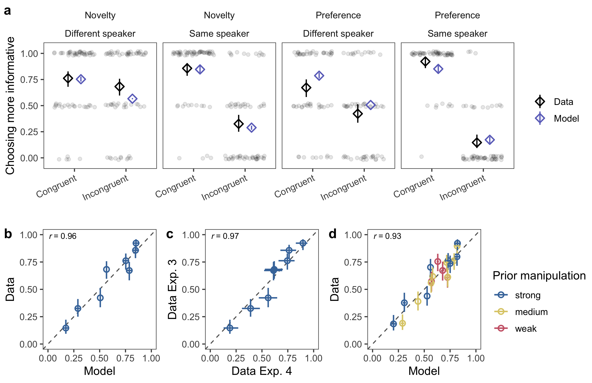

```{r load_packages, include = FALSE}
# load packages and functions

knitr::opts_chunk$set(echo = F, include = F, out.width = "\\textwidth", fig.pos = "!h")

library("papaja")
library(tidyverse)
library(knitr)
library(ggthemes)
library(langcog)
library(matrixStats)
library(coda)
#library(ggpubr)
library(lme4)
library(broom)
library(broom.mixed)
library(readxl)
library(lsr)

estimate_mode <- function(s) {
  d <- density(s)
  return(d$x[which.max(d$y)])
}

hdi_upper<- function(s){
  m <- HPDinterval(mcmc(s))
  return(m["var1","upper"])
}

hdi_lower<- function(s){
  m <- HPDinterval(mcmc(s))
  return(m["var1","lower"])
}

```


```{r data}
# load data files

# adults exp 1 
adult_ex1_data <- read_csv(file="../../stats/data/adult_ex1.csv")
# adults exp 2 novelty
adult_ex2_novelty_data <- read_csv(file="../../stats/data/adult_ex2_novelty.csv")
# adults exp 2 preference
adult_ex2_preference_data <- read_csv(file="../../stats/data/adult_ex2_preference.csv")
# adults ex3
adult_ex3_data <-read_csv(file="../../stats/data/adult_ex3.csv")
# prior strength manipulation experiments in experiment 4
adult_ex4_prior_data <-read_csv(file="../../stats/data/adult_ex4_prior.csv") 
# adults ex4
adult_ex4_data <-read_csv(file="../../stats/data/adult_ex4.csv") 

# children ex1
child_ex1_data <-read_csv(file="../../stats/data/child_ex1.csv")
# children ex2 preference
child_ex2_data <-read_csv(file="../../stats/data/child_ex2.csv") 
# children ex3
child_ex3_data <-read_csv(file="../../stats/data/child_ex3.csv") 
```

# Introduction 

Successful communication often requires an understanding that extends beyond just the meaning of words. It takes pragmatic inference -- context-sensitive reasoning about the speaker’s intentions -- to recover a speaker’s intended meaning [@grice1991studies; @levinson2000presumptive; @sperber2001relevance]. Contextual information comes in many forms. On the one hand, there is information provided by the utterance^[
We use the terms utterance, utterance-level information or utterance-level cues to capture all cues that the speaker provides for their intended meaning. This includes direct referential information in the form of pointing or gazing, semantic information in the form of conventional word meanings as well as pragmatic inferences that are licenced by the particular choice of words or actions.] itself. Competent language users expect each other to communicate in a cooperative way such that speakers produce utterances that are relevant and informative. Semantic ambiguity can be resolved by reasoning about why the speaker produced these particular behaviors [@grice1991studies; @clark1996using; @sperber2001relevance; @tomasello2008origins]. On the other hand, there is information provided by common ground: Through interaction, interlocutors gradually build up a body of mutually shared knowledge and beliefs [@bohn2018common; @clark1996using; @clark2015common]. Interlocutors expect each other to observe common ground and thus communicate in ways that are relevant to it.

Common ground and utterance-level information operate on different timelines. Utterances allow for in-the-moment inferences because they are composed of behaviors that the speaker chooses to express their intention in the here and now. On the other hand, common ground is built up over time through interaction. Nevertheless, the two information sources are intimately related because utterances are embedded in common ground. As a consequence, pragmatic reasoning in context always requires information integration. But how does this integration proceed? Verbal theories assume that information is integrated but do not specify how. An even more important question is how this integration process develops? After all, young children have less knowledge of words and syntax than adults and therefore cannot rely on the linguistic context to infer what a new word means. Instead, they heavily rely on pragmatic inferences during language learning [@bohn2019pervasive; @clark2015common; @tomasello2008origins].

In the current work, we try to answer these questions by formalizing information integration in a probabilistic model of pragmatic reasoning in development. In the remainder of this introduction, we describe the development of pragmatic inference and reasoning about common ground in childhood and then discuss the Rational Speech Act model, a formal framework that we use as the basis for our account of information integration.

# Pragmatic Development in Childhood

Children make pragmatic inferences about intended meanings based on utterance-level information, both for language understanding and language learning [@bohn2019pervasive; @clark2009first; @tomasello2008origins]. Starting very early, preverbal infants expect adults to produce utterances (in the form of pointing gestures) in a cooperative way [@behne2005one], and expect language to be carrying information [@vouloumanos2012twelve]. By age two, children are sensitive to the informativeness of communication [@o2001two]. By age three, children can use this expectation to make pragmatic inferences [@stiller2015ad; @yoon2019role] and to infer novel word meanings [@frank2014inferring].In this, they are not restricted to linguistic utterances: three-year-olds also readily infer the referent of novel non-linguistic behaviors and gestures [@bohn2019natural; @moore2015two]. And although older children continue to struggle with some complex pragmatic inferences until age five and beyond [@noveck2001children], an emerging consensus identifies these difficulties as stemming from difficulties reasoning about the semantic scope of quantifiers rather than pragmatic deficits [@skordos2016children; @horowitz2018trouble; @barner2011accessing]. Thus, children’s ability to reason about utterance-level pragmatics is present at least by ages three to five, and possibly substantially younger.In the present study, we focused on how children (and adults) make pragmatic inferences about word meanings based on the non-verbal aspects of an utterance: gaze and pointing gestures that accompany an unknown word. We adapted the procedure from @frank2014inferring, in which adults and children learned a new word based on contrasting the pointing gesture a speaker produced with alternative gestures they could have produced but did not.

What is the role of common ground information in language understanding and learning? Before reviewing the developmental literature, we want to briefly clarify how we use the term *common ground* in this paper. In the adult literature, common ground has traditionally been defined in recursive terms: in order to be part of common ground, some piece of information has to be not just known to both interlocutors but also known to both to be shared between them [@clark1996using]. Numerous studies probed the role of sharedness of information and found that it plays a critical role in communicative interactions [@brown2009partner; @hanna2003effects; @heller2016perspective; @mozuraitis2015privileged]. Based on this literature, one might argue that the term common ground should be restricted to describe situations in which the sharedness aspect is directly tested. Most of this work, however, is focused on online perspective-taking. In this paper, we use the term common ground to refer to shared information that is built up over the course of an interaction -- something that is likely easier for children [@matthews2006effect]. 

In the discussion that follows, we assume that the consequence of a direct interaction (with matching perspectives) is that information is mutually manifest; that is, not just known to both interlocutors but also assumed to be shared between them and hence part of common ground [@bohn2018common]. Thus, since this information is unproblematically in common ground, we can focus on how this information integrates with other pragmatic information sources. Construed this way, evidence for the use of common ground information by young children is strong already very early in life. For example, speaker-specific expectations guide how infants produce non-verbal gestures and interpret ambiguous utterances [@bohn2018social; @saylor2011s]. For slightly older children, common ground also facilitates word comprehension and learning [@akhtar1996role; @bohn_le_peloquin_koymen_frank_2020; @saylor2009preschoolers; @sullivan2019discourse].

In the present study, we will focus on two types of common ground information: discourse novelty and speaker preferences. Akhtar and colleagues [-@akhtar1996role; see also @diesendruck2004two] showed that 2-year-olds learn a new word by reasoning about which objects are new to the speaker in the unfolding discourse -- and thus the more likely to be referred to. Saylor and colleagues [-@saylor2009preschoolers] showed that 3- and 4-year-olds learn words by tracking the preference a speaker expressed during an ongoing interaction.

# Information Integration in Pragmatic Language Learning

The work discussed so far highlights children’s use of a single pragmatic information source or cue. Harnessing multiple – potentially competing – pragmatic cues poses a separate challenge. A central aspect of this integration problem is how to balance common ground information that is built up over the course of an interaction against information gleaned from the current utterance. Much less is known about whether and how children combine these types of information. Developmental studies that look at the integration of multiple information sources more generally find that children are sensitive to multiple sources from early on [@graham2017words; @grosse201021; @khu2020preschoolers; @matthews2006effect; @nilsen2009preschoolers; @ganea2007infants]. 

To take one example of integration processes, in a classic study, @nadig2002evidence found that children rapidly integrate information provided in an utterance (a particular referring expression) with the speaker’s perspective (the objects the speaker can see). Integration is assumed to be occurring in that common ground constrains the later processing of language. However, how this constraining works is not specified -- for example, presumably, these constraints are not absolute, implying some sort of graded combination. Furthermore, the information sources to be integrated in these studies are not all pragmatic in nature. For example, children’s ability to pick out a referent following a noun reflects their linguistic knowledge and not necessarily their ability to reason about the speaker’s intention in context. As a consequence, earlier work of this type – while providing important experimental evidence for information combination in childhood – still does not speak to the question of how (or even if) listeners integrate different forms of *pragmatic* information.

# The Rational Speech Act Framework
 
Recent innovations in probabilistic models of pragmatic reasoning provide a quantitative method for addressing the problem of integrating multiple sources of contextual information. This class of computational models, which are referred to as Rational Speech Act (RSA) models [@frank2012predicting; @goodman2016pragmatic] formalize the problem of language understanding as a special case of Bayesian social reasoning. A listener interprets an utterance by assuming it was produced by a cooperative speaker who had the goal to be informative. Being informative is defined as providing a message that would increase the probability of the listener recovering the speaker’s intended meaning in context. This notion of contextual informativeness captures the Gricean idea of cooperation between speaker and listener, and provides a first approximation to what we have described above as utterance-level pragmatic information. 

Within the RSA framework, one way to incorporate common ground is to treat it as a conversational prior. That is, previous social interactions result in a prior distribution over possible intended meanings for the current social interaction, in a manner specific to a particular speaker (i.e., Xs previous interactions with Y inform Xs current expectations about what Y is likely to talk about). Following this logic, a natural locus for information integration within probabilistic models of pragmatic reasoning is the combination of the prior probability of a particular meaning and the likelihood of the current utterance being used to express that meaning. This feature of RSA models allows them to capture situations in which different information sources (e.g., common ground vs. utterance information) point to different meanings.

When integrated into variants of RSA that allow for uncertainty about word meaning [e.g., @frank2014inferring], this natural weighting of prior and likelihood allows for the modeling of information integration. Despite of the broad use of probabilistic models in understanding word learning, other computational models of word learning have focused primarily on learning from cross-situational, co-occurrence statistics [@fazly2010probabilistic; @frank2009using] or describing generalizations about word meaning [@xu2007word] and do not provide a clear route for pragmatic information integration.

# The Current Study

We make use of this framework to study pragmatic cue integration across development. To this end, we adapt a method used in perceptual cue integration studies [@ernst2002humans]: we make independent measurements of each cue’s strength and then combine them using the RSA model described above to make independent predictions about conditions in which they either coincide or conflict. We pre-register these quantitative predictions and test them against new data from adults and children.

We start by replicating previous findings with adults showing that listeners make pragmatic inferences based on non-linguistic properties of utterances in isolation (Experiment 1). Then we show that adults make inferences based on common ground information (Experiment 2A and 2B). We use data from these experiments to estimate parameters and generate a priori predictions from RSA models about how utterance information and conversational priors should be integrated.

Models are most useful in comparison to one another. By examining differences in model fit as a function of different assumptions, we can make inferences about how specific choices lead to success or failure in capturing data. Here we consider three models that make different assumptions about the integration process. In the *integration model*, common ground and utterance-level information are integrated with one another as prior and likelihood (as described above). Our comparison models are lesioned models that assume that participants focus on one type of information and disregard the other whenever they are presented together. According to the *no conversational prior model*^[We chose to refer to the alternative models by the information source they leave out a) to highlight that they are lesioned versions of the integration model and b) to avoid the impression that the integration model takes in qualitatively different information sources.], participants focus only on the utterance information and in the *no informativeness model*, only the conversational prior is considered. These models represent plausible alternative accounts; for example, @gagliardi2017modeling found that a model that selectively ignored parts of the input best captured children’s use of statistical information during word learning. We compare predictions from the three models to new empirical data from experiments in which utterance and common ground information are manipulated simultaneously (Experiment 3 and 4).

After validating this approach with adults in Study 1, we apply the same model-driven experimental procedure to children (Study 2): We first show that children make pragmatic inferences based on utterance and common ground information separately (Experiments 5 and 6). Then we generate a priori model predictions and compare them to data from an experiment in which children are provided with both information sources (Experiment 7).

Taken together, this work makes three primary contributions: first, it shows that both adults and children integrate utterance-level information with common ground to make graded inferences about word meaning. Second, it provides an explicit theory of how this integration process proceeds and develops. Third, it uses Bayesian data analysis within the RSA framework to make a quantitative comparison of the evidence for competing hypotheses.

In a recent study, @bohn2021young used a similar approach to study information integration in children. Besides focusing on different information sources (Bohn and colleagues studied how children’s lexical knowledge integrates with discourse novelty), we extend this work in three critical ways. First, utterances in our study combine words, gestures, and gaze. With this, we capture the multimodal nature of human communication. Second, we probe the social nature of common ground by testing and modeling how the identity of the speaker influences the interpretation of the utterance. Third, by including adults in our study, we show that the same modeling framework can be used to predict the behavior of adults and children. 


```{r fig1, include = T, fig.align = "center", fig.cap = "Schematic experimental procedure with screenshots from the adult experiments. In all conditions, at test (bottom), the speaker ambiguously requested an object using a non-word (e.g. “dax”). Participants clicked on the object they thought the speaker referred to. Speech bubbles represent pre-recorded utterances. Informativeness (a) translated to making one object less frequent in context. Common ground (b) was manipulated by making one object preferred by or new to the speaker. Green plus signs represent utterances that expressed preference and red minus signs represent utterances that expressed dispreference (see main text for details). Integration (c) combined informativeness and common ground manipulations. Here we only show two (out of eight) integration conditions: preference - same speaker - incongruent (left) and novelty - different speaker - congruent (right).", out.width="100%"}
knitr::include_graphics("./figures/fig1.png")
```

# Study 1: Adults

## Participants

Adult participants were recruited via Amazon Mechanical Turk (MTurk) and received payment equivalent to an hourly wage of ~ \$9. Each participant contributed data to only one experiment. Experiment 1 and each manipulation of Experiment 2 had *N* = 40 participants. Sample size in Experiment 3 was *N* = `r length(unique(adult_ex3_data$id))`. *N* = `r length(unique(adult_ex4_prior_data$id))` participated in the experiments to measure the strong, medium and weak preference and novelty manipulations that went into Experiment 4. Finally, Experiment 4 had *N* = `r length(unique(adult_ex4_data$id))` participants. Sample sizes in all adult experiments were chosen to yield at least 120 data points per cell. All studies were approved by the Stanford Institutional Review Board (protocol no. 19960).

## Materials

All experimental procedures were pre-registered (see https://osf.io/u7kxe/registrations). Experimental stimuli are freely available in the following online repository: https://github.com/manuelbohn/mcc. All experiments were framed as games in which participants would learn words from animals. They were implemented in HTML/JavaScript as a website. Adults were directed to the website via MTurk and responded by clicking objects. For each animal character, we recorded a set of utterances (one native English speaker per animal) that were used to provide information and make requests. All experiments started with an introduction to the animals and two training trials in which familiar objects were requested (car and ball). Subsequent test trials in each condition were presented in a random order.

## Analytic approach

We preregistered sample sizes, inferential statistical analysis and computational models for all experiments. All deviations from the registered analysis plan are explicitly mentioned. All analyses were run in `R` [@R-base]. All p-values are based on two sided analysis. Cohen's d (computed via the function `cohensD`) was used as effect size for t-tests. Frequentist logistic GLMMs were fit via the function `glmer` from the package `lme4` [@R-lme4] and had a maximal random effect structure conditional on model convergence. Details about GLMMs including model formulas for each experiment can be found in the Supplementary Material.

All cognitive models and model comparisons were implemented in `WebPPL` [@dippl] using the `R` package `rwebppl` [@R-rwebppl]. Probabilistic models were evaluated using Bayesian data analysis [@lee2014bayesian], also implemented in `WebPPL`. In Experiment 3, 4 and 7, we compared probabilistic models based on Bayes Factors -- the ratio of the marginal likelihoods of each model given the data. Details on models, including information about priors for parameter estimation and Markov chain Monte Carlo settings can be found in the Supplementary Material available online. Code to run the models is available in the associated online repository.

## Experiment 1

### Methods

```{r ex1 results}
ex1t <- adult_ex1_data %>%
  group_by(condition, id) %>%
  summarise(correct = mean(correct)) %>%
  summarise(correct = list(correct)) %>%
  group_by(condition) %>%
  mutate(df= t.test(unlist(correct), mu = 0.5)$parameter,
         mean = mean(unlist(correct)),
         t_value = t.test(unlist(correct), mu = 0.5)$statistic,
         t_lci = t.test(unlist(correct), mu = 0.5)$conf.int[1],
         t_uci = t.test(unlist(correct), mu = 0.5)$conf.int[2],
         p_value = t.test(unlist(correct), mu = 0.5)$p.value,
         d = cohensD(unlist(correct), mu = 0.5)) %>%
  select(condition,mean,df,t_value,t_lci, t_uci,p_value,d)%>%
  mutate(p_value = ifelse(p_value<.001,"< .001",as.character(paste("=",substr(round(p_value,3),2,5),sep=" "))),
         t_value = round(t_value,2),
         t_lci = round(t_lci,2),
         t_uci = round(t_uci,2),
         d = round(d,2))
# model
lm_ex1 <- glmer(correct ~ condition +
              (1 |id), 
              data = adult_ex1_data, 
              family = binomial,control=glmerControl(optimizer="bobyqa",optCtrl=list(maxfun=2e5)))

#summary(lm_ex1)

ex1_r <- broom.mixed::tidy(lm_ex1, effects = "fixed")%>%
  mutate(p.value = ifelse(p.value<.001,"< .001",as.character(paste("=",substr(round(p.value,3),2,5),sep=" "))),
         std.error = round(std.error,2),
         estimate = round(estimate,2))
```

In Experiment 1, participants could learn which object a novel word referred to by assuming that the speaker communicated in an informative way [@frank2014inferring]. The speaker was located between two tables, one with two novel objects, A and B, and the other with only object A (Fig \ref{fig:fig1}a; side counterbalanced). At test, the speaker turned and pointed to the table with the two objects (A and B) and used a novel word to request one of them. The same utterance was used to make a request in all adult studies ( “Oh cool, there is a [non-word] on the table, how neat, can you give me the [non-word]?”). Participants could infer that the word referred to object B via the counter-factual inferences that, if the (informative) speaker had wanted to refer to object A, they would have pointed to the table with the single object (this being the least ambiguous way to refer to that object). This inference rests on the assumption that the speaker is communicating about an object category or type (object A or B) and not a particular object token (e.g. object A on the left table). In the control condition, both tables contained both objects and no inference could be made based on the speaker’s behavior. Participants received six trials, three per condition. 

### Results

Participants selected object B above chance in the test condition (mean = `r ex1t%>%filter(condition == "test")%>%pull(mean)`, 95% CI of mean = [`r ex1t%>%filter(condition == "test")%>%pull(t_lci)`; `r ex1t%>%filter(condition == "test")%>%pull(t_uci)`], t(`r ex1t%>%filter(condition == "test")%>%pull(df)`) = `r ex1t%>%filter(condition == "test")%>%pull(t_value)`, *p* `r ex1t%>%filter(condition == "test")%>%pull(p_value)`, d = `r ex1t%>%filter(condition == "test")%>%pull(d)`) and more often compared to the control condition (*$\beta$* = `r ex1_r%>%filter(term == "conditiontest")%>%pull(estimate)`, se = `r ex1_r%>%filter(term == "conditiontest")%>%pull(std.error)`, *p* `r ex1_r%>%filter(term == "conditiontest")%>%pull(p.value)`, see Fig \ref{fig:fig2}). This finding replicates earlier work showing that adult listeners expect speakers to communicate in an informative way.

## Experiment 2

### Methods

```{r ex2-results}
ex2tpref <- adult_ex2_preference_data %>%
  group_by(condition, id) %>%
  summarise(correct = mean(correct)) %>%
  summarise(correct = list(correct)) %>%
  group_by(condition) %>%
  mutate(df= t.test(unlist(correct), mu = 0.5)$parameter,
         mean = mean(unlist(correct)),
         t_value = t.test(unlist(correct), mu = 0.5)$statistic,
         t_lci = t.test(unlist(correct), mu = 0.5)$conf.int[1],
         t_uci = t.test(unlist(correct), mu = 0.5)$conf.int[2],
         p_value = t.test(unlist(correct), mu = 0.5)$p.value,
         d = cohensD(unlist(correct), mu = 0.5)) %>%
  select(condition,mean,df,t_value,t_lci, t_uci,p_value,d)%>%
  mutate(p_value = ifelse(p_value<.001,"< .001",as.character(paste("=",substr(round(p_value,3),2,5),sep=" "))),
         t_value = round(t_value,2),
         t_lci = round(t_lci,2),
         t_uci = round(t_uci,2),
         d = round(d,2))


# model (maximally converging)
lm_ex2pref <- glmer(correct ~ condition +
              (1|id) + (1|agent), 
              data = adult_ex2_preference_data, 
              family = binomial,control=glmerControl(optimizer="bobyqa",optCtrl=list(maxfun=2e5)))

#summary(lm_ex2pref)

ex2pref_r <- broom.mixed::tidy(lm_ex2pref, effects = "fixed")%>%
  mutate(p.value = ifelse(p.value<.001,"< .001",as.character(paste("=",substr(round(p.value,3),2,5),sep=" "))),
         std.error = round(std.error,2),
         estimate = round(estimate,2))

ex2tnov <- adult_ex2_novelty_data %>%
  group_by(condition, id) %>%
  summarise(correct = mean(correct)) %>%
  summarise(correct = list(correct)) %>%
  group_by(condition) %>%
  mutate(df= t.test(unlist(correct), mu = 0.5)$parameter,
         mean = mean(unlist(correct)),
         t_value = t.test(unlist(correct), mu = 0.5)$statistic,
         t_lci = t.test(unlist(correct), mu = 0.5)$conf.int[1],
         t_uci = t.test(unlist(correct), mu = 0.5)$conf.int[2],
         p_value = t.test(unlist(correct), mu = 0.5)$p.value,
         d = cohensD(unlist(correct), mu = 0.5)) %>%
  select(condition,mean,df,t_value,t_lci, t_uci,p_value,d)%>%
  mutate(p_value = ifelse(p_value<.001,"< .001",as.character(paste("=",substr(round(p_value,3),2,5),sep=" "))),
         t_value = round(t_value,2),
         t_lci = round(t_lci,2),
         t_uci = round(t_uci,2),
         d = round(d,2))

# model
lm_ex2nov <- glmer(correct ~ condition +
              (condition|id), 
              data = adult_ex2_novelty_data, 
              family = binomial,control=glmerControl(optimizer="bobyqa",optCtrl=list(maxfun=2e5)))

summary(lm_ex2nov)

ex2nov_r <- broom.mixed::tidy(lm_ex2nov, effects = "fixed")%>%
  mutate(p.value = ifelse(p.value<.001,"< .001",as.character(paste("=",substr(round(p.value,3),2,5),sep=" "))),
         std.error = round(std.error,2),
         estimate = round(estimate,2))
```

In Experiments 2A and 2B, we tested if participants use common ground information that is specific to a speaker to identify the referent of a novel word [@akhtar1996role; @diesendruck2004two; @saylor2009preschoolers]. In Experiment 2A, the speaker expressed a preference for one of two objects (Fig \ref{fig:fig1}b, left). There was an object on each table. The animal introduced themselves, then turned to one of the tables (left or right: counterbalanced) and expressed either that they liked (“Oh wow, I really like that one”) or disliked (“Oh bleh, I really don’t like that one”) the object before turning to the other side and expressing the respective other attitude. Next the animal disappeared and, after a short pause, either the same or a different animal returned and requested an object while facing straight ahead. Participants could use the speakers preference to identify the referent when the same speaker returned but not when a different speaker appeared whose preferences were unknown.

In Experiment 2B, common ground information came in the form of novelty (Fig \ref{fig:fig1}b, right). There was an object on one of the tables, while the other was initially empty (side counterbalanced). The animal turned to one of the tables (left or right: counterbalanced) and commented either on the presence (“Aha, look at that”) or the absence (“Hm…, nothing there”) of an object before turning to the other side and commenting in a complementary way. Later, a second object appeared on the previously empty table. Then the speaker used a novel word to request one of the objects. The referent of the novel word could be identified by assuming that the speaker uses it to refer to the object that is new to them. This inference was not licensed when a different speaker returned to whom both objects were equally new. For both novelty and preference, participants received six trials, three with the same and three with the different speaker.

### Results

In Experiment 2A, participants selected the preferred object above chance when the same speaker returned (mean = `r ex2tpref%>%filter(condition == "same_speaker")%>%pull(mean)`[`r ex2tpref%>%filter(condition == "same_speaker")%>%pull(t_lci)`; `r ex2tpref%>%filter(condition == "same_speaker")%>%pull(t_uci)`], t(`r ex2tpref%>%filter(condition == "same_speaker")%>%pull(df)`) = `r ex2tpref%>%filter(condition == "same_speaker")%>%pull(t_value)`, *p* `r ex2tpref%>%filter(condition == "same_speaker")%>%pull(p_value)`, d = `r ex2tpref%>%filter(condition == "same_speaker")%>%pull(d)`)  and more so when a different speaker returned ($\beta$ = `r ex2pref_r%>%filter(term == "conditionsame_speaker")%>%pull(estimate)`, se = `r ex2pref_r%>%filter(term == "conditionsame_speaker")%>%pull(std.error)`, *p* `r ex2pref_r%>%filter(term == "conditionsame_speaker")%>%pull(p.value)`).

In Experiment 2B, participants selected the novel object above chance when the same speaker made the request (mean = `r ex2tnov%>%filter(condition == "same_speaker")%>%pull(mean)`[`r ex2tnov%>%filter(condition == "same_speaker")%>%pull(t_lci)`; `r ex2tnov%>%filter(condition == "same_speaker")%>%pull(t_uci)`], t(`r ex2tnov%>%filter(condition == "same_speaker")%>%pull(df)`) = `r ex2tnov%>%filter(condition == "same_speaker")%>%pull(t_value)`, *p* `r ex2tnov%>%filter(condition == "same_speaker")%>%pull(p_value)`, d = `r ex2tnov%>%filter(condition == "same_speaker")%>%pull(d)`) and more often compared to when a different speaker made the request  ($\beta$ = `r ex2nov_r%>%filter(term == "conditionsame_speaker")%>%pull(estimate)`, se = `r ex2nov_r%>%filter(term == "conditionsame_speaker")%>%pull(std.error)`, *p* `r ex2nov_r%>%filter(term == "conditionsame_speaker")%>%pull(p.value)`, see Fig \ref{fig:fig2}).

```{r fig2, include = T, fig.align = "center", fig.cap = "Results from Experiments 1, 2A, and 2B for adults. For preference and novelty, control refers to a different speaker (see Fig 1b). Transparent dots show data from individual participants (slightly jittered to avoid overplotting), diamonds represent condition means, error bars are 95\\% CIs. Dashed line indicates performance expected by chance.", out.width="70%"}
knitr::include_graphics("./figures/fig2.png")
```

## Modelling information integration

Experiments 1 and 2 confirmed that adults make pragmatic inferences based on information provided by the utterance as well as by common ground and provided quantitative estimates of the strength of these inferences for use in our model. We modeled the integration of utterance informativity and common ground as a process of socially-guided probabilistic inference, using the results of Experiments 1 and 2 to inform key parameters of a computational model. The Rational Speech Act (RSA) model architecture introduced by Frank and Goodman [-@frank2012predicting] encodes conversational reasoning through the perspective of a listener (“he” pronoun) who is trying to decide on the intended meaning of the utterance he heard from the speaker (“she” pronoun). The basic idea is that the listener combines his uncertainty about the speaker’s intended meaning -- a prior distribution over referents $P(r)$ -- with his generative model of how the utterance was produced: a speaker trying to convey information to him. To adapt this model to the word learning context, we enrich this basic architecture with a mechanism for expressing uncertainty about the meanings of words (lexical uncertainty) -- a prior distribution over lexica $P(L)$ [@bergen2016pragmatic]. 

$$P_{L}(r, \mathcal{L}|u)\propto P_{S}(u|r, \mathcal{L}) \cdot P( \mathcal{L}) \cdot P(r)$$

In the above equation, the listener is trying to jointly resolve the speaker’s intended referent $r$ and the meaning of words (thus learning the lexicon $\mathcal{L}$). He does this by imagining what a rational speaker would say, given the referent they are trying to communicate and a lexicon. The speaker is an approximately rational Bayesian actor (with degree of rationality $\alpha$), who produces utterances as a function of their informativity. The space of utterances the speaker could produce depends upon the lexicon $P(u|\mathcal{L})$; simply put, the speaker labels objects with the true labels under a given lexicon L (see Supplementary Material available online for details):

$$P_{S}(u|r,\mathcal{L})\propto Informativity(u;r)^\alpha \cdot P(u|\mathcal{L})$$

The informativity of an utterance for a referent is taken to be the probability with which a naive listener, who only interprets utterances according to their literal semantics, would select a particular referent given an utterance.

$$Informativity(u; r) = P(r|u) \propto P(r) \cdot \mathcal{L}_{point}$$

The speaker’s possible utterances are pairs of linguistic and non-linguistic signals, namely labels,  points, and gaze. Because the listener does not know the lexicon, the informativity of an utterance comes from the speaker’s point and gaze, the meaning of which is encoded in $\mathcal{L}_{point}$ and is simply a truth-function checking whether or not the referent is at the location picked out by the speaker’s point/gaze. Though the speaker makes their communicative decision assuming the listener does not know the meaning of the labels, we assume that in addition to pointing and/or gazing at the location, the speaker produces a label consistent with their own lexicon $\mathcal{L}$, described by $P(u|\mathcal{L})$. Importantly, we assume that each label in the lexicon refers to an object type (e.g., object A) and not an object token (e.g., object A on the left table) [@csibra2009natural] (see Supplementary Material for modeling details).

This computational model provides a natural avenue to formalize quantitatively how the informativeness of an utterance and conversational priors trade-off during word learning. As mentioned above, we treat common ground as a conversational prior over meanings, or types of referents, that the speaker might be referring to. That is, we assume that the interactions around the referents in the present context (i.e., preference or novelty; Experiment 2A and B) result in a speaker-specific prior distribution over referents. We use the results from Experiment 2 to specify this distribution: For example, in Experiment 2, for the preference/same speaker participants chose the object the speaker liked (e.g., object B) with a proportion of 0.97 and the object the speaker disliked (object A) with 0.03. In Experiments 3 and 4, this measurement determined the prior distribution over objects in cases whenever the same manipulation was used (preference/same speaker). Note that Experiment 3 involved three objects while Experiment 2 only involved two. We nevertheless used the exact proportions measured in Experiment 2 for each object as unnormalized probabilities in the prior. This approach conserved the relative relation between object types. Thus, when utterance and common ground information were aligned (i.e. object B was the more informative referent) the unnormalized distribution over objects was [$P(A_1)$ = 0.03, $P(B)$ = 0.97, $P(A_2)$ = 0.03] and after normalizing it was [0.03, 0.94, 0.03]. When information sources were dis-aligned (i.e. object A was the more informative referent), the object distribution was [0.97, 0.03, 0.97] or [0.49, 0.02, 0.49] after normalizing. 

The in-the-moment, contextual informativeness of the utterance is captured in the likelihood term, whose value depends on the rationality parameter $\alpha$. Assumptions about rationality may change depending on context and we therefore used the data from Experiment 1 to specify $\alpha$. We performed a Bayesian analysis in which we used the integration model (assuming equal prior probability over referents) with an unknown a priori value of $\alpha$, and conditioned on the data from Experiment 1 to compute a posterior distribution over $\alpha$; in turn, the model generates posterior predictions for the proportion of correct responses in Experiment 1. We computed the maximum a posteriori (MAP) estimate and used this value for $\alpha$ to generate model predictions for Experiment 3 and 4. For additional information on parameter estimation we ask the reader to consult the Supplementary Material.

Based on these parameters, the model generates predictions for situations in which utterance and common ground expectations are jointly manipulated (Fig \ref{fig:fig1}c). In the Supplementary Material, we include a worked example in which we walk the reader through the steps of computing model predictions from the parameters and the model equations. We recommend going through this example to get a better understanding of the model. 

In addition to the parameters fit to the data from previous experiments, we include a noise parameter, which can be thought of as reflecting the cost that comes with handling and integrating multiple information sources. Technically, the noise parameter represents the proportion of responses better explained by a process of random guessing than by pragmatics; we estimate this parameter from the observed data (Experiment 3). Including the noise parameter greatly improved the model fit to the data (see Supplementary Material for details). We did not pre-register the inclusion of a noise parameter for Experiment 3 but did so for all subsequent experiments.

## Experiment 3

### Methods

```{r ex3 GLMM, cache=F}
# model 
lm_ex3 <- glmer(correct_inf ~ common_ground_manipulation*speaker*alignment + (alignment|id), 
              data = adult_ex3_data, family = binomial, 
              control=glmerControl(optimizer="bobyqa",optCtrl=list(maxfun=2e5)))

#summary(lm_ex3)

lm_ex3_r <- broom.mixed::tidy(lm_ex3, effects = "fixed")%>%
  mutate(p.value = ifelse(p.value<.001,"< .001",as.character(paste("=",substr(round(p.value,3),2,5),sep=" "))),
         std.error = round(std.error,2),
         estimate = round(estimate,2))

```

```{r model comparison ex3}
ex3_bf <- bind_rows(
  readRDS("../../stats/saves/ex3_prior_only_model_noise_loglike.rds") %>% mutate(model = "prior_only_noise"),
  readRDS("../../stats/saves/ex3_pragm_model_noise_loglike.rds") %>% mutate(model = "pragmatic_noise"),
  readRDS("../../stats/saves/ex3_flat_prior_model_noise_loglike.rds") %>% mutate(model = "flat_prior_noise")
)%>%
  group_by(model)%>%
  summarize(logP = logSumExp(value))%>%
  bind_rows(readRDS("../../stats/saves/ex3_pragm_model_loglike.rds") %>% mutate(model = "pragmatic_parameter_free"))%>%
  spread(model, logP) %>%
  mutate("pragmatic_noise_pragmatic_parameter_free" = exp(pragmatic_noise - pragmatic_parameter_free),
         "pragmatic_noise_prior_only_noise" = exp(pragmatic_noise - prior_only_noise),
         "pragmatic_noise_flat_prior_noise" = exp(pragmatic_noise - flat_prior_noise),
         "prior_only_noise_flat_prior_noise" = exp(prior_only_noise - flat_prior_noise)) %>%
  select(-pragmatic_parameter_free,-pragmatic_noise, -flat_prior_noise, -prior_only_noise)


ex3_pragm_model_noise_param <- readRDS("../../stats/saves/ex3_pragm_model_noise.rds") %>%
  filter(Parameter %in% c("noise"))  %>%
  summarise(mean = estimate_mode(value), 
            ci_lower = hdi_lower(value),
            ci_upper = hdi_upper(value))%>%
  round(digits = 2)

ex3_flat_prior_model_noise_param <- readRDS("../../stats/saves/ex3_flat_prior_model_noise.rds") %>%
  filter(Parameter %in% c("noise"))  %>%
  summarise(mean = estimate_mode(value), 
            ci_lower = hdi_lower(value),
            ci_upper = hdi_upper(value))%>%
  round(digits = 2)

ex3_prior_only_model_noise_param <- readRDS("../../stats/saves/ex3_prior_only_model_noise.rds") %>%
  filter(Parameter %in% c("noise"))  %>%
  summarise(mean = estimate_mode(value), 
            ci_lower = hdi_lower(value),
            ci_upper = hdi_upper(value))%>%
  round(digits = 2)
```

In Experiment 3, we combined the procedures of Experiment 1 and 2A or 2B. The test setup was identical to Experiment 1, however, before making a request, the speaker interacted with the objects so that some of them were preferred by or new to them (Fig \ref{fig:fig1}c). This combination resulted in two ways in which the two information sources could be aligned with one another. In the congruent condition, the object that was the more informative referent in the present context was also the one that was preferred by or new to the speaker. In the incongruent condition, the object that was the less informative referent in the present context was the one that was preferred by or new to the speaker.

In the preference condition, the speaker turned to one table, pointed to the object and expressed either liking or disliking using the same utterances as in Experiment 2A. To make it clear which object the speaker was referring to while pointing to the table with two objects, the referred-to object was temporarily enlarged. Whether the speaker first turned to the table with a single object or to the one with the two objects was counterbalanced. In the congruent condition, the preferred object was also the one that was unique to the table with the two objects. In the incongruent condition, the preferred object was also present on the other table.

In the novelty condition,  the scene began with only one object on one of the tables. After commenting on the presence and absence of objects in the same way as in Experiment 2B, the speaker disappeared and two additional objects appeared, one on the previously empty table and one on the other table. Whether the speaker first turned to the empty table or to the one with an object was counterbalanced. In the congruent condition, two different objects appeared so that the object that was unique to the table with the two objects was also new in context. In the incongruent condition, two identical objects appeared so that the object that was unique to the table was the one that was old in context. The test event was the same for preference and novelty: the speaker turned to the table with the two objects and used the same request as in Experiment 1.   

Taken together, there were 2 (novelty or preference) x 2 (same or different speaker) x 2 (congruent or incongruent) = 8 conditions in Experiment 3. For each of these eight conditions, we generated model predictions using the modeling framework introduced above. To arbitrate between hypotheses about how information is integrated, we compared the three models introduced in the introduction: The *integration model* in which both information sources are flexibly combined, the *no conversational prior model* that focused only on utterance-level information and the *no informativeness model* that focused only on common ground information.

Participants completed eight trials for one of the common ground manipulations with two trials per condition (same/different speaker x congruent/incongruent). Conditions were presented in a random order. We discuss and visualize the results as the proportion with which participants chose the more informative object (i.e., the object that would be the more informative referent when only utterance information is considered). 

### Results

As a first step, we used a GLMM to test whether participants were sensitive to the different ways in which information could be aligned. We found that participants distinguished between congruent and incongruent trials when the speaker remained the same (model term: `alignment x speaker`; $\beta$ = `r lm_ex3_r%>%filter(term == "speakersame_speaker:alignmentincongruent")%>%pull(estimate)`, se = `r lm_ex3_r%>%filter(term == "speakersame_speaker:alignmentincongruent")%>%pull(std.error)`, *p* `r lm_ex3_r%>%filter(term == "speakersame_speaker:alignmentincongruent")%>%pull(p.value)`). Thus, participants were sensitive to the different combinations of manipulations.

```{r fig3, include = T, fig.align = "center", fig.cap = "Results from Experiment 3 and 4 for adults. Data and model predictions by condition for Experiment 3 (a). Transparent dots show data from individual participants (slightly jittered to avoid overplotting), diamonds represent condition means. Correlation between model predictions and data in Experiment 3 (b), between data in Experiment 3 and the direct replication in Experiment 4 (c) and between model predictions and data in Experiment 4 (d). Coefficients and p-values are based on Pearson correlation statistics. Error bars represent 95\\% HDIs." , out.width="100%"}


```

As a second step, we compared the cognitive model predictions to the data. Participants’ average responses were highly correlated with the predictions from the integration model in each condition (Fig \ref{fig:fig3}b). When comparing models, we found that model fit was unambiguously better for the *integration model* compared to the *no conversational prior model* (Bayes Factor (BF) = `r format(ex3_bf%>%pull(pragmatic_noise_flat_prior_noise), digits = 2)`) or the *no informativeness model* (BF = `r format(ex3_bf%>%pull(pragmatic_noise_prior_only_noise), digits = 2)`), suggesting that participants considered and integrated both sources of information. 

Finally, we examined the noise parameter for each model. The estimated proportion of random responses according to the *integration model* was `r ex3_pragm_model_noise_param%>%pull(mean)` (95% Highest Density Interval (HDI) =  [`r ex3_pragm_model_noise_param%>%pull(ci_lower)` - `r ex3_pragm_model_noise_param%>%pull(ci_upper)`]). This parameter was substantially lower for the *integration model* compared to the alternative models (*no conversational prior model*: `r ex3_flat_prior_model_noise_param%>%pull(mean)` [`r ex3_flat_prior_model_noise_param%>%pull(ci_lower)` - `r ex3_flat_prior_model_noise_param%>%pull(ci_upper)`]; *no informativeness model*: `r ex3_prior_only_model_noise_param%>%pull(mean)` [`r ex3_prior_only_model_noise_param%>%pull(ci_lower)` - `r ex3_prior_only_model_noise_param%>%pull(ci_upper)`]), lending additional support to the conclusion that the *integration model* better captured the behavioral data. Rather than explaining systematic structure in the data, the alternative models achieved their best fit only by assuming a very high level of noise.

## Experiment 4

### Methods

```{r model comparison ex4}
ex4_bf <- bind_rows(
  readRDS("../../stats/saves/ex4_prior_only_model_noise_loglike.rds") %>% mutate(model = "prior_only_noise"),
  readRDS("../../stats/saves/ex4_pragm_model_noise_loglike.rds") %>% mutate(model = "pragmatic_noise"),
  readRDS("../../stats/saves/ex4_flat_prior_model_noise_loglike.rds") %>% mutate(model = "flat_prior_noise")
)%>%
  group_by(model)%>%
  summarize(logP = logSumExp(value))%>%
  spread(model, logP) %>%
  mutate("pragmatic_noise_prior_only_noise" = exp(pragmatic_noise - prior_only_noise),
         "pragmatic_noise_flat_prior_noise" = exp(pragmatic_noise - flat_prior_noise),
         "prior_only_noise_flat_prior_noise" = exp(prior_only_noise - flat_prior_noise)) %>%
  select(-pragmatic_noise, -flat_prior_noise, -prior_only_noise)

ex4_pragm_model_noise_param <- readRDS("../../stats/saves/ex4_pragm_model_noise.rds") %>%
  filter(Parameter %in% c("noise"))  %>%
  summarise(mean = estimate_mode(value), 
            ci_lower = hdi_lower(value),
            ci_upper = hdi_upper(value))%>%
  round(digits = 2)

ex4_flat_prior_model_noise_param <- readRDS("../../stats/saves/ex4_flat_prior_model_noise.rds") %>%
  filter(Parameter %in% c("noise"))  %>%
  summarise(mean = estimate_mode(value), 
            ci_lower = hdi_lower(value),
            ci_upper = hdi_upper(value))%>%
  round(digits = 2)

ex4_prior_only_model_noise_param <- readRDS("../../stats/saves/ex4_prior_only_model_noise.rds") %>%
  filter(Parameter %in% c("noise"))  %>%
  summarise(mean = estimate_mode(value), 
            ci_lower = hdi_lower(value),
            ci_upper = hdi_upper(value))%>%
  round(digits = 2)


```

To test the scope of the *integration model*, we first replicated and then extended the results of Experiment 3 to a broader range of experimental conditions. Specifically, we manipulated the strength of the common ground information (3 levels -- strong, medium and weak -- for preference and 2 levels -- strong and medium -- for novelty) by modifying the way the speaker interacted with the objects prior to the request. The procedural details and statistical analysis for these manipulations are described in the Supplementary Material. For Experiment 4, we paired each level of prior strength manipulation with the informativeness inference in the same way as in Experiment 3. This resulted in a total of 20 conditions, for which we generated a priori model predictions in the same way as in Experiment 3. That is, we conducted a separate experiment for each level of prior strength and common ground manipulation to estimate the prior probability of each object following this particular manipulation (analogous to Experiment 2). This prior distribution was then passed through the model for the congruent and incongruent conditions, resulting in a unique prediction for each of the 20 conditions. Given the graded nature of the prior manipulations, Experiment 4 basically tests how well the model performs with different types of prior distributions.

The strong prior manipulation in Experiment 4 was a direct replication of Experiment 3 (see Fig \ref{fig:fig3}c). Each participant was randomly assigned to a common ground manipulation and a level of prior strength and completed eight trials in total, two in each unique condition in that combination. 

### Results

The direct replication of Experiment 3 within Experiment 4 showed a very close correspondence between the two rounds of data collection (see Fig \ref{fig:fig3}c). GLMM results for Experiment 4 can be found in the Supplementary Material available online. Here we focus on the analysis based on the probabilistic models. Model predictions from the *integration model* were again highly correlated with the average response in each condition (see Fig \ref{fig:fig3}d). We evaluated model fit for the same models as in Experiment 3 and found again that the *integration model* fit the data much better compared to the *no conversational prior* (BF = `r format(ex4_bf%>%pull(pragmatic_noise_flat_prior_noise), digits = 2)`) or the *no informativeness model* (BF = `r format(ex4_bf%>%pull(pragmatic_noise_prior_only_noise), digits = 2)`). The inferred level of noise based on the data for the *integration model* was `r ex4_pragm_model_noise_param%>%pull(mean)`[`r ex4_pragm_model_noise_param%>%pull(ci_lower)` - `r ex4_pragm_model_noise_param%>%pull(ci_upper)`], which was similar to Experiment 3 and again lower compared to the alternative models (*no conversational prior model*: `r ex4_flat_prior_model_noise_param%>%pull(mean)` [`r ex4_flat_prior_model_noise_param%>%pull(ci_lower)` - `r ex4_flat_prior_model_noise_param%>%pull(ci_upper)`]; *no informativeness model*: `r ex4_prior_only_model_noise_param%>%pull(mean)` [`r ex4_prior_only_model_noise_param%>%pull(ci_lower)` - `r ex4_prior_only_model_noise_param%>%pull(ci_upper)`]).

# Study 2: Children

The previous section showed that competent language users flexibly integrate information during pragmatic word learning. Do children make use of multiple information sources during word learning as well? How does this integration emerge developmentally? While many verbal theories of language learning imply that such integration does occur, the actual process of integration has rarely been described nor tested in detail. Here we provide an explanation in the form of our *integration model* and test if it is able to capture children’s word learning. Embedded in the assumptions of the model is the idea that developmental change occurs via  changes in the strengths of the individual inferences, which leads to a change in the strength of the integrated inference. As a starting point, our model assumes developmental continuity in the integration process itself [@bohn2019pervasive], though this assumption could be called into question by a poor model fit. The study for children followed the same general pattern as the one for adults. We generated model predictions for how information should be integrated by first measuring children’s ability to use utterance-level and common ground information in isolation when making pragmatic inferences. We then adapted our model to study developmental change: We sampled children continuously between 3.0 and 5.0 years of age – a time in which children have been found to make the kind of pragmatic inferences we studied here [@bohn2019pervasive; @frank2014inferring] -- and generated model predictions for the average developmental trajectory in each condition.

## Participants

Children were recruited from the floor of the Children’s Discovery Museum in San Jose, California, USA. Parents gave informed consent and provided demographic information. Each child contributed data to only one experiment. We collected data from a total of 243 children between 3.0 and 5.0 years of age. We excluded 15 children due to less than 75% of reported exposure to English, five because they responded incorrectly on 2/2 training trials, three because of equipment malfunction, and two because they quit before half of the test trials were completed. The final sample size in each experiment was as follows: *N* = `r length(unique(child_ex1_data$id))` (41 girls, mean age = `r round(mean(child_ex1_data$age_num),2)`) in Experiment 5,  *N* = `r length(unique(child_ex2_data$id))` (28 girls, mean age = `r round(mean(child_ex2_data$age_num),2)`) in Experiment 6 and *N* = `r length(unique(child_ex3_data$id))` (54 girls, mean age = `r round(mean(child_ex3_data$age_num),2)`) in Experiment 7. For Experiment 5 and 6, we also tested two-year-olds but did not find sufficient evidence that they use utterance and/or common ground information in the tasks we used to justify investigating their ability to integrate the two. Sample sizes in all experiments were chosen to yield at least 80 data points in each cell for each age group.

## Materials

All procedures, sample sizes and data analyses were again pre-registered; materials, data, and analysis code can be found in the associated repository (see Study1). Experiments were implemented in the same general way as for adults. Children were guided through the games by an experimenter and responded by touching objects on the screen of an iPad tablet [@frank2016using].

## Experiment 5

### Methods

```{r child ex1 and 2 results}
#experiment 1
child_ex1t <- child_ex1_data %>%
  group_by(age_bin, id) %>%
  summarise(correct = mean(correct)) %>%
  summarise(correct = list(correct)) %>%
  group_by(age_bin) %>%
  mutate(df= t.test(unlist(correct), mu = 0.5)$parameter,
         mean = mean(unlist(correct)),
         t_value = t.test(unlist(correct), mu = 0.5)$statistic,
         t_lci = t.test(unlist(correct), mu = 0.5)$conf.int[1],
         t_uci = t.test(unlist(correct), mu = 0.5)$conf.int[2],
         p_value = t.test(unlist(correct), mu = 0.5)$p.value,
         d = cohensD(unlist(correct), mu = 0.5)) %>%
  select(age_bin,mean,df,t_value,t_lci, t_uci,p_value,d)%>%
  mutate(p_value = ifelse(p_value<.001,"< .001",as.character(paste("=",substr(round(p_value,3),2,5),sep=" "))),
         t_value = round(t_value,2),
         t_lci = round(t_lci,2),
         t_uci = round(t_uci,2),
         d = round(d,2))


child_ex1_lm_data <- child_ex1_data%>%
  mutate(age_num = scale(age_num, center = TRUE, scale = TRUE))

# GLMM
child_ex1_lm <- glmer(correct ~ age_num + (1 | id), 
              data = child_ex1_lm_data, family = binomial, 
              control=glmerControl(optimizer="bobyqa",optCtrl=list(maxfun=2e5)))

#summary(child_ex1_lm)

child_lm_ex1_r <- broom.mixed::tidy(child_ex1_lm, effects = "fixed")%>%
  mutate(p.value = ifelse(p.value<.001,"< .001",as.character(paste("=",substr(round(p.value,3),2,5),sep=" "))),
         std.error = round(std.error,2),
         estimate = round(estimate,2))

# experiment 2
child_ex2t <- child_ex2_data %>%
  group_by(condition,age_bin, id) %>%
  summarise(correct = mean(correct)) %>%
  summarise(correct = list(correct)) %>%
  group_by(condition,age_bin) %>%
  mutate(df= t.test(unlist(correct), mu = 0.5)$parameter,
         mean = mean(unlist(correct)),
         t_value = t.test(unlist(correct), mu = 0.5)$statistic,
         t_lci = t.test(unlist(correct), mu = 0.5)$conf.int[1],
         t_uci = t.test(unlist(correct), mu = 0.5)$conf.int[2],
         p_value = t.test(unlist(correct), mu = 0.5)$p.value,
         d = cohensD(unlist(correct), mu = 0.5)) %>%
  select(condition,age_bin,mean,df,t_value,t_lci, t_uci,p_value,d)%>%
  mutate(p_value = ifelse(p_value<.001,"< .001",as.character(paste("=",substr(round(p_value,3),2,5),sep=" "))),
         t_value = round(t_value,2),
         t_lci = round(t_lci,2),
         t_uci = round(t_uci,2),
         d = round(d,2))

# GLMM

child_ex2_lm_data <- child_ex2_data%>%
  mutate(age_num = scale(age_num, center = TRUE, scale = TRUE))

child_ex2_lm <- glmer(correct ~ age_num*condition + (condition | id) + (1 | agent), 
              data = child_ex2_lm_data, family = binomial, 
              control=glmerControl(optimizer="bobyqa",optCtrl=list(maxfun=2e5)))

summary(child_ex2_lm)

child_lm_ex2_r <- broom.mixed::tidy(child_ex2_lm, effects = "fixed")%>%
  mutate(p.value = ifelse(p.value<.001,"< .001",as.character(paste("=",substr(round(p.value,3),2,5),sep=" "))),
         std.error = round(std.error,2),
         estimate = round(estimate,2))

```

Experiment 5 for children was modeled after @frank2014inferring. Instead of appearing on tables, objects were presented as hanging in trees, which facilitated the depiction of a speaker pointing to distinct locations. After introducing themselves, the animal turned to the tree with two objects and said: “This is a tree with a [non-word], how neat, a tree with a [non-word]”). Next, the trees and the objects in them disappeared and new trees replaced them. The two objects from the tree the animal turned to previously were now spread across the two trees (one object per tree, position counterbalanced). While facing straight, the animal first said “Here are some more trees” and then asked the child to pick the tree with the object that corresponded to the novel word (“Which of these trees has a [non-word]?”). Children received six trials in a single test condition. 

### Results

To compare children’s performance to chance level, we binned age by year. Four-year-olds selected the more informative object (i.e. the object that was unique to the location the speaker turned to) above chance (mean = `r child_ex1t%>%filter(age_bin =="4")%>%pull(mean)`[`r child_ex1t%>%filter(age_bin =="4")%>%pull(t_lci)`; `r child_ex1t%>%filter(age_bin =="4")%>%pull(t_uci)`], t(`r child_ex1t%>%filter(age_bin =="4")%>%pull(df)`) = `r child_ex1t%>%filter(age_bin =="4")%>%pull(t_value)`, *p* `r child_ex1t%>%filter(age_bin =="4")%>%pull(p_value)`, d = `r child_ex1t%>%filter(age_bin =="4")%>%pull(d)`). Three-year-olds, on the other hand, did not (mean = `r child_ex1t%>%filter(age_bin =="3")%>%pull(mean)`[`r child_ex1t%>%filter(age_bin =="3")%>%pull(t_lci)`; `r child_ex1t%>%filter(age_bin =="3")%>%pull(t_uci)`], t(`r child_ex1t%>%filter(age_bin =="3")%>%pull(df)`) = `r child_ex1t%>%filter(age_bin =="3")%>%pull(t_value)`, *p* `r child_ex1t%>%filter(age_bin =="3")%>%pull(p_value)`, d = `r child_ex1t%>%filter(age_bin =="3")%>%pull(d)`). Consequently, when we fit a GLMM to the data with age as a continuous predictor, performance increased with age ($\beta$ = `r child_lm_ex1_r%>%filter(term == "age_num")%>%pull(estimate)`, se = `r child_lm_ex1_r%>%filter(term == "age_num")%>%pull(std.error)`, *p* `r child_lm_ex1_r%>%filter(term == "age_num")%>%pull(p.value)`, see Fig \ref{fig:fig4}). Thus, children’s ability to use utterance information in a word learning context increased with age.

```{r fig4, include = T, fig.align = "center", fig.cap = "Results from Experiment 5 and 6 for children. For preference, control refers to to the different speaker condition (see Fig. 1B). Transparent dots show data from individual participants (slightly jittered to avoid overplotting), regression lines show fitted linear models with 95\\% CIs. Dashed line indicates performance expected by chance.", out.width="70%"}
knitr::include_graphics("./figures/fig4.png")
```

## Experiment 6

### Methods

In Experiment 6, we assessed whether children use common ground information to identify the referent of a novel word. We tested children only with the preference manipulation^[We initially tested children with the novelty as well as the preference manipulation. We found that children made the basic inference in that they selected the object that was preferred by or new to the speaker, but found little evidence that children distinguished between requests made by the same speaker or a different speaker in the case of novelty. This finding contrasts with earlier work [@diesendruck2004two]. Since our focus was on how children integrate informativeness and conversational priors resulting from common ground, we did not follow up on this finding but dropped the novelty manipulation and focused on preference for the remainder of the study. We studied information integration in children using the novelty manipulation in a different study [@bohn2021young]]. The procedure for children was identical to the preference manipulation for adults. Children received eight trials, four with the same and four with a different speaker.

### Results

Four-year-olds selected the preferred object above chance when the same speaker made the request (mean = `r child_ex2t%>%filter(condition == "same_speaker" ,age_bin =="4")%>%pull(mean)`[`r child_ex2t%>%filter(condition == "same_speaker" ,age_bin =="4")%>%pull(t_lci)`; `r child_ex2t%>%filter(condition == "same_speaker" ,age_bin =="4")%>%pull(t_uci)`], t(`r child_ex2t%>%filter(condition == "same_speaker" ,age_bin =="4")%>%pull(df)`) = `r child_ex2t%>%filter(condition == "same_speaker" ,age_bin =="4")%>%pull(t_value)`, *p* `r child_ex2t%>%filter(condition == "same_speaker" ,age_bin =="4")%>%pull(p_value)`, d = `r child_ex2t%>%filter(condition == "same_speaker" ,age_bin =="4")%>%pull(d)`), whereas three-year-olds did not (mean = `r child_ex2t%>%filter(condition == "same_speaker" ,age_bin =="3")%>%pull(mean)`[`r child_ex2t%>%filter(condition == "same_speaker" ,age_bin =="3")%>%pull(t_lci)`; `r child_ex2t%>%filter(condition == "same_speaker" ,age_bin =="3")%>%pull(t_uci)`], t(`r child_ex2t%>%filter(condition == "same_speaker" ,age_bin =="3")%>%pull(df)`) = `r child_ex2t%>%filter(condition == "same_speaker" ,age_bin =="3")%>%pull(t_value)`, *p* `r child_ex2t%>%filter(condition == "same_speaker" ,age_bin =="3")%>%pull(p_value)`, d = `r child_ex2t%>%filter(condition == "same_speaker" ,age_bin =="3")%>%pull(d)`). When the different speaker made the request, performance was at chance level in both age groups (three-year-olds: mean = `r child_ex2t%>%filter(condition == "different_speaker" ,age_bin =="3")%>%pull(mean)`[`r child_ex2t%>%filter(condition == "different_speaker" ,age_bin =="3")%>%pull(t_lci)`; `r child_ex2t%>%filter(condition == "different_speaker" ,age_bin =="3")%>%pull(t_uci)`]; four-year-olds: mean = `r child_ex2t%>%filter(condition == "different_speaker" ,age_bin =="4")%>%pull(mean)`[`r child_ex2t%>%filter(condition == "different_speaker" ,age_bin =="4")%>%pull(t_lci)`; `r child_ex2t%>%filter(condition == "different_speaker" ,age_bin =="4")%>%pull(t_uci)`]. When we fit a GLMM to the data with age as a continuous predictor, we found an effect of speaker identity ($\beta$ = `r child_lm_ex2_r%>%filter(term == "conditionsame_speaker")%>%pull(estimate)`, se = `r child_lm_ex2_r%>%filter(term == "conditionsame_speaker")%>%pull(std.error)`, *p* `r child_lm_ex2_r%>%filter(term == "conditionsame_speaker")%>%pull(p.value)`) but no effect of age ($\beta$ = `r child_lm_ex2_r%>%filter(term == "age_num")%>%pull(estimate)`, se = `r child_lm_ex2_r%>%filter(term == "age_num")%>%pull(std.error)`, *p* `r child_lm_ex2_r%>%filter(term == "age_num")%>%pull(p.value)`) or interaction between speaker identity and age ($\beta$ = `r child_lm_ex2_r%>%filter(term == "age_num:conditionsame_speaker")%>%pull(estimate)`, se = `r child_lm_ex2_r%>%filter(term == "age_num:conditionsame_speaker")%>%pull(std.error)`, *p* `r child_lm_ex2_r%>%filter(term == "age_num:conditionsame_speaker")%>%pull(p.value)`, see Fig \ref{fig:fig4}). Thus, children across the age range used common ground information to infer the referent of a novel word.

## Modelling information integration in children

Model predictions for children were generated using the same model described above for adults. To incorporate developmental change in the model, we allowed the rationality parameter $\alpha$ (which controls the degree of speaker informativeness) and the prior distribution over objects (a proxy for common ground) to change with age.

We defined $\alpha$ for a given age via a simple linear regression. Thus, instead of inferring a single value across age, we used the data from Experiment 5 to find the intercept ($\beta^\alpha_0$) and slope ($\beta^\alpha_1$) that best described the developmental trajectory in those data. As for adults, we inferred  via the integration model with equal prior probabilities for each object. We computed a posterior distribution for the intercept and the slope of this regression function. In Experiment 7, the speaker optimality parameter for a child of a given age was computed by taking the MAP for the intercept and adding the MAP for the slope times the child’s age $i$: $\alpha_i = \beta^\alpha_0 + i \cdot \beta^\alpha_1$.

To estimate the prior distribution over objects, we used the data from Experiment 6 to model the intercepts ($\beta^\rho_{0,j}$) and slopes ($\beta^\rho_{1,j}$) that best described the developmental trajectories in the data for each of the two ($j$) conditions. This allowed us to generate prior distributions over objects in the cognitive model that were sensitive to the child’s age. We used a simple logistic regression to find the intercept and slope (MAP of posterior distribution) that best described children’s performance in the two conditions of Experiment 6. In Experiment 7, the prior probability for an object was computed by taking the intercept for the respective condition $j$, adding the slope times the child’s age $i$ and then using a logistic transformation to convert the outcome into proportions: $\rho_{i,j} = \text{logistic}(\beta^\rho_{0,j} + i \cdot \beta^\rho_{1,j})$. Because these proportions corresponded to a two-object scenario, they were then converted to the three-object scenario by assuming equal probabilities for objects of the same type and normalizing. The overall distribution depended on the alignment of information sources in the same way as it did for adults. The Supplementary Material provides additional information on the parameter estimation. 

These parameter settings were then used to generate age sensitive model predictions in 2 (same or different speaker) x 2 (congruent or incongruent) = 4 conditions. As for adults, all models included a noise parameter, which was estimated based on the data of Experiment 7.

## Experiment 7

### Methods

```{r child ex3 GLMM, cache = F}
child_ex3_lm_data <- child_ex3_data%>%
  mutate(age_num = scale(age_num, center = TRUE, scale = TRUE))

child_ex3_lm <- glmer(correct_inf ~ age_num*speaker*alignment 
      + (speaker+alignment | id), 
      family = "binomial",
      data = child_ex3_lm_data,
      control=glmerControl(optimizer="bobyqa",optCtrl=list(maxfun=2e5)))

summary(child_ex3_lm)

child_lm_ex3_r <- broom.mixed::tidy(child_ex3_lm, effects = "fixed")%>%
  mutate(p.value = ifelse(p.value<.001,"< .001",as.character(paste("=",substr(round(p.value,3),2,5),sep=" "))),
         std.error = round(std.error,2),
         estimate = round(estimate,2))
```

In Experiment 7, we combined the procedures of Experiment 5 and 6 and collected new data from children between 3.0 and 5.0 years of age in each of the four conditions (Fig \ref{fig:fig1}c). We again inserted the preference manipulation into the setup of Experiment 5. After greeting the child, the animal turned to one of the trees, pointed to an object -- which was temporarily enlarged and moved closer to the animal -- and expressed either liking or disliking. Then, the animal turned to the other tree and expressed the opposite attitude (disliking or liking) for the other kind of object. Next, the animal disappeared and either the same or a different animal returned. We counterbalanced whether the speaker first turned to the tree with the two objects or the tree with a single object. The remainder of the trial was identical to the request phase of Experiment 5. Children received eight trials, two per condition (same/different speaker x congruent/incongruent) in a randomized order.

### Results

As a first step, we used a GLMM to test whether children were sensitive to the different ways in which information could be aligned. Children’s propensity to differentiate between congruent and incongruent trials for the same or a different speaker increased with age (model term: `age x alignment x speaker`; $\beta$ = `r child_lm_ex3_r%>%filter(term == "age_num:speakersame_speaker:alignmentincongruent")%>%pull(estimate)`, se = `r child_lm_ex3_r%>%filter(term == "age_num:speakersame_speaker:alignmentincongruent")%>%pull(std.error)`, *p* `r child_lm_ex3_r%>%filter(term == "age_num:speakersame_speaker:alignmentincongruent")%>%pull(p.value)`).

```{r child model comparison}

child_ex3_bf <- readRDS("../../stats/saves/child_ex3_model_comparison.rds") %>%
  group_by(parameter)%>%
  select(-ci_lower, -ci_upper)%>%
  spread(model, logP) %>%
  mutate("pragmatic_flat_prior" = exp(pragmatic - flat_prior),
         "pragmatic_prior_only" = exp(pragmatic - prior_only),
         "flat_prior_prior_only" = exp(flat_prior - prior_only)) %>%
  select(-pragmatic,-flat_prior, -prior_only)


child_ex3_pragm_model_noise_param <- readRDS("../../stats/saves/child_ex3_pragm_model_noise.rds") %>%
  filter(Parameter %in% c("noise"))  %>%
  summarise(mean = estimate_mode(value), 
            ci_lower = hdi_lower(value),
            ci_upper = hdi_upper(value))

child_ex3_flat_prior_model_noise_param <- readRDS("../../stats/saves/child_ex3_flat_prior_model_noise.rds") %>%
  filter(Parameter %in% c("noise"))  %>%
  summarise(mean = estimate_mode(value), 
            ci_lower = hdi_lower(value),
            ci_upper = hdi_upper(value))

child_ex3_prior_only_model_noise_param <- readRDS("../../stats/saves/child_ex3_prior_only_model_noise.rds") %>%
  filter(Parameter %in% c("noise"))  %>%
  summarise(mean = estimate_mode(value), 
            ci_lower = hdi_lower(value),
            ci_upper = hdi_upper(value))

```

Analyses comparing the model predictions from the probabilistic models to the data suggest that children flexibly integrate conversational priors and informativity information. Furthermore, this integration process is accurately captured by the *integration model* at least for four-year-olds. For the correlational analysis, we binned model predictions and data by year. There was a substantial correlation between the predicted and measured average response for four-year-olds, but less so for three-year-olds (Fig \ref{fig:fig5}b). One of the reasons for the latter was the low variation between conditions. For the model comparison, we treated age continuously. As with adults, we found a much better model fit for the *integration model* compared to the *no conversational prior* (BF = `r format(child_ex3_bf%>%filter (parameter=="noise")%>%pull(pragmatic_flat_prior), digits = 2)`) or the *no informativeness model* (BF = `r format(child_ex3_bf%>%filter (parameter=="noise")%>%pull(pragmatic_prior_only), digits = 2)`). 

The inferred level of noise based on the data for the integration model was `r child_ex3_pragm_model_noise_param%>%pull(mean)` [`r child_ex3_pragm_model_noise_param%>%pull(ci_lower)` - `r child_ex3_pragm_model_noise_param%>%pull(ci_upper)`], which was lower compared to the alternative models considered (*no conversational prior model*: `r child_ex3_flat_prior_model_noise_param%>%pull(mean)` [`r child_ex3_flat_prior_model_noise_param%>%pull(ci_lower)` - `r child_ex3_flat_prior_model_noise_param%>%pull(ci_upper)`]; *no informativeness model*: `r child_ex3_prior_only_model_noise_param%>%pull(mean)` [`r child_ex3_prior_only_model_noise_param%>%pull(ci_lower)` - `r child_ex3_prior_only_model_noise_param%>%pull(ci_upper)`]) but numerically higher than that of adults (see Fig \ref{fig:fig5}c). 

The high level of inferred noise moved the model predictions for children in all conditions close to chance level. We therefore compared two additional sets of models with different parameterizations of the noise parameter that emphasized differences between conditions in the model predictions more (see Supplementary Material and Fig \ref{fig:fig5}a). This analysis was not pre-registered. Parameter free models did not include a noise parameter and developmental noise models allowed the noise parameter to change with age. 

In each case, the integration model provided a better fit compared to the alternative models (parameter-free: integration vs. no conversational prior BF = `r format(child_ex3_bf%>%filter (parameter=="parameter free")%>%pull(pragmatic_flat_prior), digits = 2)`, integration vs. no informativeness BF = `r format(child_ex3_bf%>%filter (parameter=="parameter free")%>%pull(pragmatic_prior_only), digits = 2)`; developmental noise:  integration vs. no conversational prior BF = `r format(child_ex3_bf%>%filter (parameter=="developmental noise")%>%pull(pragmatic_flat_prior), digits = 2)`, integration vs. no informativeness BF = `r format(child_ex3_bf%>%filter (parameter=="developmental noise")%>%pull(pragmatic_prior_only), digits = 2)`). The developmental noise parameter for the integration model decreased with age, suggesting that for younger children, the model explained the data by assuming a high rate of random guessing, whereas, for older children, the model explained the data by virtue of the processes that are implemented in its structure (see Fig \ref{fig:fig5}d).

```{r fig5, include = T, fig.align = "center", fig.cap = "Results from Experiment 7 for children. (a) Model predictions (with 95\\% HDIs) and data across age in the four conditions. Transparent black dots show data from individual participants and black lines show conditional means of the data with 95\\% CI. Black diamonds show the mean of the data for age bins by year and error bars show 95\\% CIs. (b) Correlation between model predictions (with noise parameter) and condition means binned by year (with 95\\% HDIs). For 4-year-olds, two conditions yielded the same data means and model predicitons and are thus plotted on top of each other. (c) Posterior distribution of the noise parameter for the different models. (d) Developmental trajectory of the noise paramter for the three developmental noise models; trajectories are based on MAPs of the posterior distribution for the intercept and slope.", out.width = "100%"}
knitr::include_graphics("./figures/fig5.png")
```

# General Discussion

Integrating multiple sources of information is an integral part of human communication. To infer the intended meaning of an utterance, listeners must combine their knowledge of communicative conventions (semantics and syntax) with social expectations about their interlocutor. This integration is especially vital in early language learning when the different varieties of pragmatic information are among the most important sources of information for learners who may not yet have mastered syntax and semantics [@bohn2019pervasive]. But how are pragmatic cues integrated during word learning? Here we used a Bayesian cognitive model to formalize this integration process. We studied how utterance-level (Gricean) expectations about informative communication are integrated with conversational priors (resulting from common ground). Adults’ and children’s learning was best predicted by a model in which both sources of information traded-off flexibly. Alternative models that considered only one source of information made substantially worse predictions.

We begin our discussion by contextualizing our modeling findings and then turn to the developmental implications of the modeling results. We end with some discussion of the limitations of our experimental tasks and our computational model. 

# Modeling Contributions

Cue integration in language processing has been extensively studied in recent decades, but the focus of this work has usually been on how adults combine perceptual, semantic or syntactic information [@tanenhaus1995integration; @kamide2003integration; @hagoort2004integration; @ozyurek2007line]. We extend the study of linguistic cue integration to pragmatics. Most importantly, however, we present a substantive theory of the integration process itself. Real world language comprehension and learning happens in socially dynamic and complex situations which inevitably require integrating multiple pragmatic information sources. The *integration model* provides a formal description of the process of information integration, at least at the computational level of analysis [@marr1982vision]. As such, our work complements theorizing about information integration in other domains of language comprehension [e.g., @fourtassi2020optimal; @mcclelland2006there; @smith2017multimodal].

All of the models we compared here integrated some explicit structure, rather than (for example) simply weighing information sources by some ratio. Predictions thus result from models of the task rather than simply models of the data. That is, inferences are not computed separately by the modeler and specified as inputs to a regression model, but instead are the results of an integrated process that operates over a (schematic) representation of the experimental stimuli. Further, our models are variants derived from the broader RSA framework, which has been integrated into larger systems for language learning in context [@wang2016learning; @cohn2018pragmatically; @monroe2017colors].

What does the integration model tell us about the way in which information is integrated? The model assumes that the informativeness of an utterance depends on the person-specific conversational priors (resulting from common ground). Broadly speaking, it formalizes the view that common ground is the starting point to determine how informative a given utterance is. As such, the model gives an explicit and formal description of how common ground may constrain the processing of utterances -- something that was unspecified in earlier experimental work on information integration [e.g., @khu2020preschoolers; @nadig2002evidence].

Our conception of information integration explains the seemingly counterintuitive predictions of the model. For example, one might expect the model to predict a chance level performance in the same speaker – incongruent conditions because the two cues “pull” the listener in opposite directions. Instead, the model predicts a performance below chance, favoring the object implicated by the prior -- which also matches adults’ responses. This subtle prediction emerges because the listener assumes that the speaker takes the conversational prior shared between the speaker and the (naive) listener as a starting point when computing the effect of each utterance. As a consequence, when prior interactions strongly implicate one object as the more likely referent, the speaker reasons that this object will be the inferred referent of any semantically plausible utterance, even when the same utterance would point to a different object in the absence of a conversational prior. 

Taken together, our model advances classic theories on pragmatic language comprehension [@grice1991studies; @sperber2001relevance] and learning [@bruner1983child; @tomasello2009constructing] by providing an explicit description of the integration process. The model thereby offers a computational description of how information may be integrated during pragmatic word learning. Future work will be required to understand if and how the RSA framework, which typically makes aggregate predictions at the group level, can be used to understand the moment-by-moment and trial-by-trial behavior of individuals. Individuals’ behavior could well result from a heuristic approximation to full RSA-type inference. New methods will likely need to be developed to evaluate this conjecture. 

# Developmental Findings

The correlational analysis showed that the *integration model* accurately predicted information integration in four-year-olds. However, the model did not successfully describe three-year-olds’ inferences; thus, it is possible that they were not able to integrate information sources. Our findings are also consistent with a simpler explanation, namely that the overall weaker responses we observed in the independent measurement experiments (Experiments 5 and 6), combined with some noise in responding, led the younger age group to appear relatively random in their responses. As a consequence, there was not much variation in the group-level performance of three-year-olds for the model to explain. The results of the model comparison also support this interpretation. Here, we treated age continuously and found that the integration model provided the best fit across the entire age range. Taken together, we may say that as soon as children are sufficiently sensitive to the individual information sources, the integration model accurately describes the way that information is integrated. To strengthen this interpretation, future work should use tasks (or age groups) that show a clear and strong response for each information source.

Our model presents a substantive theory of the development of information integration during word learning. The primary source of developmental change in our model is age-related changes in the propensity to make individual inferences. As they get older, children expect speakers to be more informative and more likely to observe common ground. Still, the process by which the two information sources are integrated at any given age is assumed to be the same. The alternative models we considered are plausible accounts of other ways in which information could be integrated, but they also share the assumption of developmental continuity with respect to the integration process. Thus, in future work, it would be important to explore alternative models for the development of the integration process; one possible candidate would be a model in which the integration process itself changes with age. 

Bohn and colleagues [-@bohn2021young] explored such an alternative integration model. They used a similar modeling framework but studied different information sources. In addition to an integration model that is structurally comparable to the one described here, they formulated a biased integration model which assumed that children are biased towards some information sources over others. In a developmental version of this biased model, they assumed that the strength of this bias changes with age, which represents an alternative view on development. However, when directly compared, the integration model explained their data better.   

The developmental noise model reported for Experiment 7 offers yet another way to address the question of developmental change. This model estimates a developmental trajectory for the proportion of responses that are better explained by random guessing than by the model structure (see Fig \ref{fig:fig5}d). If such a data analytic model would find that model fit is comparable for younger and older children but that the noise parameter through which this fit is achieved decreases with age, we might conclude that cognitive abilities that pertain to task demands are the major locus of change rather than abilities that have to do with integrating information. In the developmental noise model in Experiment 7, we found that noise decreased with age but, at the same time, that the resulting model fit was substantially worse for three-year-old children. As mentioned in the previous paragraph, we think that a lack of sensitivity to the individual information sources, rather than a failure to integrate them, is the reason for this poor model fit in the younger age group. The strongest evidence for developmental changes in integration would come in a case where younger children showed evidence of above/below-chance judgment in the combined task (Experiment 7) that was distinct from that predicted by the two above/below-chance component tasks (Experiment 5 and 6). Such a comparison would require more precision (either via more trials or more participants) than our current experiment affords, however.

# Limitations

An important limitation of our experimental work is that we studied a single population of American-English speaking children and adults using a computerized storybook task. It is therefore unclear how our results would transfer to different populations and/or different experimental methods. Regarding the first point, we expect substantial variation across cultures and languages in how sensitive children are to the different information sources. The few studies that investigated pragmatic inferences similar to the ones we observed in our study found substantial variation [@su2015interpretation; @zhao2021development; @fortier2018ad]. Extending this work to study information integration will be a very valuable avenue for future research. Nevertheless, we think that our modeling framework provides an excellent tool to study universalities and differences in information integration.    

Our modeling work is limited in that we did not model the social-cognitive processes that underlie common ground. Instead, we assumed that the interactions that preceded the utterance (and presumably constitute common ground) result in a person-specific conversational prior. From a modeling perspective, this approach treats common ground as equivalent to more basic manipulations of contextual salience [e.g. in @frank2012predicting]. Thus, our model would not differentiate between a situation in which an object would be salient because it has been the focus of an interaction and one in which it would be more salient because it was big or colorful. Thus, evoking common ground in this context is largely backed-up by the experimental tasks: the fact that participants (children and adults) were sensitive to the identity of the speaker tells us that the contextual salience of the referents resulted from a process of social reasoning. Thus, we feel confident in saying that our results speak to how participants integrated different sources of pragmatic information. Based on a process model of common ground, one could further specify how common ground information (i.e. social context) interacts with other contextual information [@degen2015wonky; @tessler2017warm]. 

Our model also does not take into account the important distinction for psycholinguistics, namely the difference between privileged ground vs. common ground. This distinction has been addressed computationally by Heller and colleagues [@heller2016perspective; @mozuraitis2018modeling]. In their work, they focus on how listeners identify the referent of ambiguous referring expressions. Their probabilistic model simultaneously considers the (differing) perspectives of both interlocutors and trades off between them. In principle, the model of Heller and colleagues [-@heller2016perspective] and the *integration model* could be combined with one another to address how privileged vs common ground trades off with other pragmatic information.

# Conclusion

Studying how multiple types of pragmatic cues are balanced contributes to a more comprehensive understanding of word learning. In the current study, participants inferred the referent by integrating non-linguistic cues (gaze and pointing gestures) with assumptions about speaker informativeness and common ground information, going beyond previous experimental work in measuring how these information sources were combined. The real learning environment is far richer than what we captured in our experimental design, however. For example, in addition to multiple layers of social information, children can rely on semantic and syntactic features of the utterances as cues to meaning [@clark1973s; @gleitman1990structural]. Across development, children learn to recruit these different sources of information and integrate them. RSA models allow for the inclusion of semantic information as part of the utterance [@bergen2016pragmatic] and it will be a fruitful avenue for future research to model the integration of linguistic and pragmatic information across development. To conclude, our work here shows how computational models of language comprehension can be used as powerful tools to explicate and test hypotheses about information integration across development. 

\newpage

# References
```{r create_r-references}
r_refs(file = "r-references.bib")
```

\begingroup
\setlength{\parindent}{-0.5in}
\setlength{\leftskip}{0.5in}

<div id = "refs"></div>
\endgroup

\newpage

# Authornote

We thank Jacqueline Quirke and Sabina Zacco for help with the data collection and Bria Long and Gregor Kachel for comments on an earlier version of the paper. Manuel Bohn received funding from the European Union’s Horizon 2020 research and innovation programme under the Marie Sklodowska-Curie grant agreement no. 749229. Michael Henry Tessler was supported by a National Science Foundation SBE Postdoctoral Research Fellowship Grant No. 1911790. Michael C. Frank was supported by a Jacobs Foundation Advanced Research Fellowship and the Zhou Fund for Language and Cognition. Parts of Study 1 appeared in the proceedings of the 41st Annual Meeting of the Cognitive Science Society, Montreal, Canada, 2019. All experiments and analyses were pre-registered (https://osf.io/u7kxe/). Experiments, data, and analysis code are available in a public repository (https://github.com/manuelbohn/mcc).

# Declarations of interest

None.

# Author Contributions

M. Bohn and M.C. Frank conceptualized the study, M. Merrick collected the data, M. Bohn and M.H. Tessler analyzed the data, M. Bohn, M. H. Tessler and M.C. Frank wrote the manuscript, all authors approved the final version of the manuscript.


