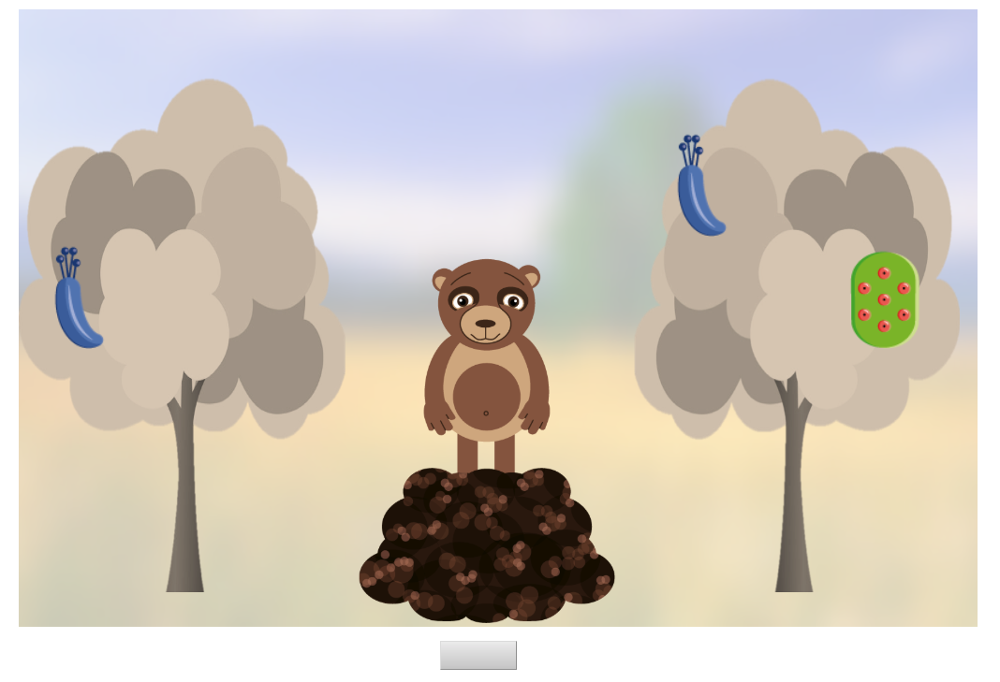

```{r import data, include = F}
###
library(tidyverse)
library(knitr)
library(langcog)
library(ggthemes)
library(jsonlite)
library(readxl)
library(coda)

estimate_mode <- function(s) {
  d <- density(s)
  return(d$x[which.max(d$y)])
}

hdi_upper<- function(s){
  m <- HPDinterval(mcmc(s))
  return(m["var1","upper"])
}

hdi_lower<- function(s){
  m <- HPDinterval(mcmc(s))
  return(m["var1","lower"])
}

## importing data
files <- dir("~/Work/MCC/git-mcc/kids_EX3/pref/")

raw_data <- data_frame()
for (f in files) {
  jf <- paste("~/Work/MCC/git-mcc/kids_EX3/pref/",f,sep="")
  jd <- jsonlite::fromJSON(paste(readLines(jf), collapse=""))
  date <- str_sub(jf,42,str_length(jf)-11)
  id <- as_data_frame(jd$data$data) %>% mutate(test_date = date)
  raw_data <- bind_rows(raw_data, id)
}

raw_data <- raw_data %>%
  mutate(subid = ifelse(subid == "181128_3_ex3p....","181128_3_ex3p" , subid),
         subid = ifelse(subid == "181128_1_ex3p.","181128_1_ex3p" , subid),
         subid = ifelse(subid == " 181218_10_ex3p","181218_10_ex3p" , subid))
#unique(raw_data$subid)

log <- read_excel("../../../MCC-subject_log.xlsx", 1)%>%
  filter(Condition == "ex3p")%>%
  select(subid,experimenter,keep_drop,sex,dob)

#unique(log$subid)
sum(log$keep_drop == "drop")

d <- left_join(raw_data,log, by = "subid")%>%
  filter(keep_drop == "keep")%>%
  mutate(dob = as.numeric(dob),
         dob = as.Date(dob,origin = "1899-12-30"),
         age_num = lubridate::time_length(difftime(test_date,dob), "years"),
         check_age = ifelse(substr(age_num,1,1) == subage, T, F))

```

## Overview

This is what the study looked like. The animal first commented on an object on one side, then on an object on the other side (preference manipulation) and then disappeared. Then either the same or a different animal returned (speaker change manipulation), turned to the tree with the two objects and said it had a e.g. "dax". Then, two new trees appeared, each with one type of object and children were asked to pick the tree with the "dax". 

```{r setup, echo = F, fig.cap="Screenshot from the experiment", fig.align = "center"}



```

Manipulations: 

* Age: Measured continuous 
* Speaker: same or different
* Alignment: congruent(preferred object = less frequent) or in-congruent (preferred = more frequent)

Crossing this results in four conditions (cells) per age group. Data was collected within subjects, with two (one if they decided to opt out earlier) trials per cell (combination of alignment and speaker).

Total N = `r length(unique(d$subid))`. We amended the preregistration saying that we want 80 data points per cell. The table below shows that we got this.

```{r kids per age group, echo = F }
d %>%
  filter(trial != "filler1",trial != "filler2")%>%
  group_by(subage,speaker,alignment)%>%
  summarise(n = length(unique(subid)),
            datapoints = n())%>%
  knitr::kable(digits = 2)
```

### Filler trials

Filler trials by age. Each child started with two filler trials. In these trials, each tree only had one feature. Children had no problem learning words in unambiguous cases, showing they get the basic procedure. 

```{r filler by age, echo= FALSE, fig.height=3,fig.width=3}
pf1 <- d %>%
      filter(trial == "filler1" | trial == "filler2")%>%
  group_by(subage, subid) %>%
  summarise(correct = mean(correct_inf)) 

pf2 <- pf1 %>%
  multi_boot_standard(col = "correct")


ggplot() +
  geom_jitter(data = pf1, aes(x = subage, y = correct,  alpha = .2),width = .1,height = .025)+
  geom_pointrange(data = pf2, aes(x = subage, y = mean, ymin = ci_lower, ymax = ci_upper),size = .8)+
  geom_hline(yintercept = 0.5, lty=2)+
  labs(x="",y="Proportion Expected Choice")+
  theme_few() +
  ylim(-0.05,1.05)+
  guides(alpha = F)
```

## Comparison to chance by age bin

### Plot

For the plot, data is aggregated within individual and age bin. Looking at the data this way, it looks like 3-year-olds do not care about speaker and alignment but have a slight overall tendency to pick the more informative object. 4-year-olds, on the other hand, seem to behave quite differently in the different cells.
```{r plot by age binned}

p1 <- d %>%
  filter(trial != "filler1",
         trial != "filler2")%>%
  group_by(speaker, alignment ,subage, subid) %>%
  summarise(correct = mean(correct_inf)) 

p2 <- p1 %>%
  multi_boot_standard(col = "correct")


ggplot() +
  geom_jitter(data = p1, aes(x = alignment, y = correct, col = alignment, alpha = .2),width = .3,height = .025)+
  geom_pointrange(data = p2, aes(x = alignment, y = mean, col = alignment, ymin = ci_lower, ymax = ci_upper),size = .8)+
  geom_hline(yintercept = 0.5, lty=2)+
  labs(x="",y="Proportion Expected Choice")+
  theme_few() +
  facet_grid(speaker~subage)+
  ylim(-0.05,1.05)+
  guides(alpha = F)+ 
  scale_colour_solarized(name="Alignment")
```

### Model within each cell

Given the unequal number of trials per subject, we pre-registered models for the comparison to chance within each cell, testing the intercept against 0. Model structure was: `correct_inf ~ 1 + (1|subid) + (1|agent)`. Results are in line with what you see in the plot above.

```{r chance_comp, warning=F, message=F}
library(lme4)

mod <- d %>%
  filter(trial != "filler1",
         trial != "filler2")%>%
  group_by(subage,speaker,alignment) %>%
  do(models = glmer(correct_inf ~ 1+ (1|subid) + (1|agent),data=., family=binomial, control=glmerControl(optimizer="bobyqa",optCtrl=list(maxfun=2e5))))

library(broom)

tidy(mod, models) %>%
  filter(term =="(Intercept)") %>%
  select(-term, -group)%>%
  kable(digits = 2)
```

## Plot by age continous

Here is the data plotted with age continuous. Regression lines and CIs are based on loess fits. 

```{r plot by age}

p3 <- d %>%
  filter(trial != "filler1",
         trial != "filler2")%>%
  group_by(speaker, alignment ,age_num, subid)

ggplot(data = p3, aes(x = age_num, y = correct_inf)) +
  geom_jitter(width = .025,height = .025, alpha = .2)+
    geom_smooth(col = "black", size = 0.8, method = "glm", method.args = list(family = "binomial"), se = T,  alpha = .7)+
  geom_hline(yintercept = 0.5, lty=2)+
  labs(x="Age",y="Proportion more informative")+
  theme_few() +
  facet_grid(speaker~alignment)+
  ylim(-0.05,1.05)+
  guides(alpha = F)


```

## GLMM

The goal of the frequentest model was to see if the three manipulations (age, speaker and alignment have an effect). The model converges as pre-registered: `correct_inf ~ age_num*speaker*alignment + (speaker*alignment | subid) + (age_num*speaker*alignment | agent)`.

The significant 3-way interaction shows that all three components matter. This is good news, showing that all of the things we hypothesized to be important actually affected children's behavior.

```{r model, cache = T, warning=F, message=F}

library(lme4)

dm <- d %>%
  filter(trial != "filler1",
         trial != "filler2")%>%
  mutate(age_num = scale(age_num, center = T, scale = T))


mex3 <- glmer(correct_inf ~ age_num*speaker*alignment 
      + (speaker*alignment | subid) 
      + (age_num*speaker*alignment | agent), 
      family = "binomial",
      data = dm,
      control=glmerControl(optimizer="bobyqa",optCtrl=list(maxfun=2e5)))


tidy(mex3) %>%
  filter(group =="fixed") %>%
  select(-group)%>%
  kable(digits = 2)

```

## Comparing data to model 

### Models vs data by age contious

The black line is the loess fit based on the data (same as above). Models are shown in different colors. It looks like the RSA model is making the best predictions (relative to the others). The fit is far from perfect, but I guess that was expected. We will eventually compare models using Bayes Factors. 

```{r comparison plot by age,warning=F, message=F, fig.height= 6, fig.width=10}

p_data <- d %>%
  filter(trial != "filler1",
         trial != "filler2")%>%
  mutate(age_bin = age_num - 3,
         Speaker = ifelse(speaker == "same", "same_speaker", "different_speaker"),
         Alignment = alignment)%>%
  group_by(Speaker, alignment ,age_bin, subid)


kids_model_comp_mean_ci <- readRDS("../saves/kids_model_comp_mean_ci.rds")

ggplot(kids_model_comp_mean_ci)+
  geom_ribbon(aes(x =age_bin, ymin = lci, ymax = uci, fill = model), alpha = .4) +
  geom_line(aes(age_bin, mean, col = model), size = 1, alpha = .5, linetype = 2) + 
  geom_smooth(data = p_data, aes(x = age_bin, y = correct_inf), col = "black", size = 0.8, method = "glm", method.args = list(family = "binomial"), se = T,  alpha = .7)+
  geom_hline(yintercept = 0.5, lty=2)+
  labs(y="proportion more informative")+
  scale_x_continuous(limits=c(0,2), name="age", breaks = c(0,0.5,1,1.5,2), labels = c(3.0,3.5,4.0,4.5,5)) +
  ylim(-0.05,1.05)+
  facet_grid(Speaker~Alignment)+
  theme_few(base_size = 20)+
  scale_color_viridis_d(direction = -1)+
  scale_fill_viridis_d(direction = -1)
```

```{r, include = F}
ggsave("../graphs/kids_all_model.pdf", width = 11.1, height = 8, scale = 1)
```


### Correlation plot by age bin

Not sure if this makes much sense: I binned and averaged the model predictions and the data by age to get correlation plots. Even though the correlation is higher for the prior only model, the predictions are systematically off.
```{r, cache = T, warning=F, message=F}

data <- d %>%
  filter(trial != "filler1",
         trial != "filler2")%>%
  mutate(Speaker = ifelse(speaker == "same", "same_speaker", "different_speaker"),
         Alignment = alignment)%>%
  group_by(Speaker, Alignment ,subage) %>%
  summarize(k = sum(correct_inf), n = n())%>%
  ungroup() %>%
  mutate(a = 1 + k,
         b = 1 + n - k,
         Data_ci_lower  = qbeta(.025, a, b),
         Data_ci_upper = qbeta(.975, a, b),
         Data = (a-1)/(a+b-2))%>%
  select(-a,-b,-n,-k)


kids_model_comp <- readRDS("../saves/kids_model_comp.rds")

model <- kids_model_comp %>%
  mutate(subage = ifelse(age_bin<1,"3","4"))%>%
  group_by(model,Speaker,Alignment,subage)%>%
  summarise(Model = mean(prop_informative),
            Model_ci_lower = hdi_lower(prop_informative),
            Model_ci_upper = hdi_upper(prop_informative))
  

cor_plot <- model %>%
  ungroup()%>%
  mutate(Data = rep(data$Data,3),
         Data_ci_lower = rep(data$Data_ci_lower,3),
         Data_ci_upper  =rep(data$Data_ci_upper,3))


library(ggpubr)


ggplot(data = cor_plot,aes(x = Model, y = Data, col = subage)) +
  geom_abline(intercept = 0, slope = 1, lty = 2, alpha = 1, size = .5)+
  geom_point(size = 3)+
  geom_errorbar(aes(ymin = Data_ci_lower, ymax = Data_ci_upper),width = 0,size = .5)+
  geom_errorbarh(aes(xmin = Model_ci_lower, xmax = Model_ci_upper), height = 0,size = .5)+
  coord_fixed()+
  stat_cor(method = "pearson", label.x = 0.1, label.y = 0.9, aes(x = Model, y = Data), inherit.aes = F)+
  facet_grid(~model)+
  xlim(0,1)+ylim(0,1)+
  xlab("Model")+
  theme_few(base_size = 10) + 
  scale_colour_solarized()
```